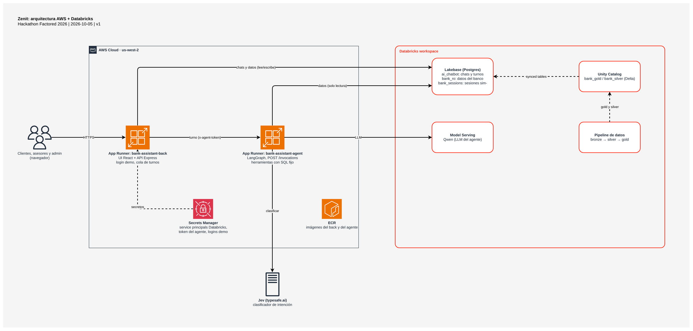

<h1 align="center">Zenit</h1>

<p align="center">AI-assisted customer service for retail banks: an AI agent answers customers and hands off to human advisors with full context.</p>

<p align="center">
  
</p>

## Features

- AI customer agent (David) in Spanish and Portuguese: answers credit card and
  savings account questions, registers complaints and checks their status.
- Intent and guardrail classification with Jev; keyword rules as fallback.
- Policy outside the model: handoff rules are deterministic code, the LLM only
  reads language and writes the reply.
- Secure by design: the customer's identity comes from the session, never from
  the chat text, and every data read is fixed SQL filtered by that customer.
- Human handoff with context: David collects and verifies the case first, then
  stops replying until an advisor returns the chat.
- Advisor console: an inbox of human cases and a separate view of the chats
  David is handling.
- Turn queue in the back: messages that arrive while the agent is answering wait
  in Lakebase and are processed in order.
- Governed data: a bronze → silver → gold pipeline on Databricks, copied to
  Lakebase as read-only synced tables.

## Development

The platform has three components that run independently:

**Agent** is a LangGraph graph served at `POST /invocations`.

```bash
cd agent && uv run start-server                 # → :8000 (needs agent/.env)
cd agent && uv run --group dev pytest tests -q  # tests
```

**Back** is an Express server: API, demo login, chat history and the turn queue.
It serves the built front.

```bash
cd front && npm install && npm run build
cd back && npm install && npm run build && npm run start   # → :3000
```

**Front** is the React chat UI and advisor console. For hot reload, run
`npm run dev` in `back` (port 3001) and in `front` (port 3000).

`back/.env` needs `DATABRICKS_CONFIG_PROFILE` and
`API_PROXY=http://localhost:8000/invocations`.

## Deployment

The back (with the front built in) and the agent run on AWS App Runner
(us-west-2). Chats and bank data stay in Lakebase, and the LLM runs on
Databricks Model Serving.

### Data (once, or after new files)

Requirements: Databricks CLI.

```bash
python data/generate_dummy_data.py
databricks fs cp -r --overwrite data/dummy_output dbfs:/Volumes/workspace/bank_bronze/landing
cd data && databricks bundle deploy && databricks bundle run bank_data_pipeline
```

The gold and silver tables are copied to Lakebase with the scripts in
`back/scripts/bank-ro/`.

### Back and agent on AWS

Requirements: an AWS session, Docker, `jq`, `openssl`.

```bash
cd back && scripts/aws/deploy.sh    # build, push and roll out the back
cd agent && scripts/aws/deploy.sh   # build, push and roll out the agent
```

First-time setup (ECR, IAM roles, secrets, services):
[back](back/scripts/aws/README.md) and [agent](agent/scripts/aws/README.md).

## Docs

Grouped by the hackathon's evaluation dimensions. The evidence for each one,
with its numbers, is in [Evaluation criteria](docs/evaluation-criteria.md).

### Technical judgment

Architecture, trade-offs, reliability, safety and production readiness.

- [Architecture on AWS + Databricks](docs/arquitectura-aws-databricks.md):
  flow, services and decisions.
- [Path to production](docs/camino-a-produccion.md): what changes for a real
  bank, and why (CloudFront, LLM capacity, identities, login).
- [Agent and back limits](docs/limites-agente-back.md): who stores what.
- [Agent architecture](docs/agent_architecture.md): shared core, playbooks and
  human review.

### AI engineering

Backend, frontend, system integration and deployment.

- [Agent](agent/README.md): use cases and technical decisions.
- [Attention flow](docs/flujo-atencion.md): conversation stages and handoff to
  advisors.
- [Evaluation of David](docs/evaluacion.md): 60 test cases × 3 runs, before and
  after, local and production.
- [Deployment with CDK](infra/README.md): the AWS stack.
- [Demo runbook](docs/demo-runbook.md).

### Data engineering

Data quality, pipelines, preparation and reproducibility.

- [Data pipeline](data/README.md): data contract and bronze/silver/gold.
- [Pipeline validation](docs/data_pipeline_validation.md).
- [Bank data in Lakebase](docs/datos-banco-lakebase.md): synced tables and
  access.

### Machine learning

Modeling approach, evaluation, baselines and performance.

- [Fraud model](ml/README.md): features, training and evaluation.
- [Fraud model proposal](docs/ml_fraud_model_proposal.md).
- [Fraud data reference](docs/fraud_data_reference.md).

### Data analytics

Metrics, insights, visualization and decision support.

- [Admin fraud intelligence dashboard](docs/admin_fraud_dashboard.md): data
  insights, complaint prediction coverage and model evaluation at `/fraud`.
- [Admin retention dashboard](docs/admin_retention_dashboard.md): customer
  follow-up signals at `/retention`.
- [Analytics serving](docs/admin_analytics_serving.md): how the dashboards read
  and cache their data.

## License

Built for the Factored AI & Data Hackathon 2026. Derived from the Databricks
[banking-agent-accelerator](https://github.com/databricks-industry-solutions/banking-agent-accelerator)
and modified by the team. See [LICENSE.md](LICENSE.md) and
[NOTICE.md](NOTICE.md).
