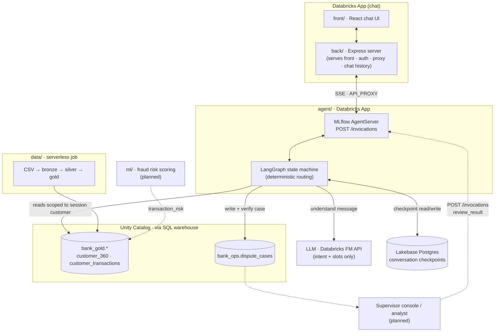

# Bank Assistant

An AI-assisted customer-service platform for retail banks. AI agents talk to customers in Spanish and Portuguese and resolve routine requests on their own, within explicit bank policy. Human supervisors oversee those conversations from a console that surfaces the cases that matter most to the bank, such as possible fraud or customers at risk of leaving. The first workflow is card and account charge disputes.

**Main features**

- **AI customer agent (es/pt):** understands the request, finds the customer's transaction, asks when something is ambiguous, and files the case once the customer confirms.
- **Policy outside the model:** eligibility, escalation and permissions are versioned, deterministic rules. The LLM only reads language, and every decision records the rules that fired.
- **Secure by design:**
  - Identity comes from a trusted session, never from chat text.
  - Every data read is scoped to that customer.
  - Actions are reported only after they are verified.
- **Human handoff with context:** escalated cases carry the request, verified facts, actions taken, policy rules and open questions, so the customer never repeats themselves.
- **Supervisor console (planned):**
  - Watch live conversations and their traces.
  - Take over a conversation, or approve or reject escalated cases.
  - Receive prioritized alerts for fraud, churn risk, SLA breaches and security events.
- **Fraud risk model (planned):** a model trained on transaction history scores each disputed charge, and the policy uses the score to route cases to fraud analysts.
- **Governed data platform:** a bronze → silver → gold pipeline on Databricks with a data contract, quality report and lineage.
- **Measurable:** use-case scenarios double as tests and as the evaluation set. It reports automated resolution, handoff quality, unsafe outcomes, latency and cost.

Built on Databricks (Apps, Unity Catalog, Lakebase, MLflow, Foundation Model API) with LangGraph, for the Factored AI & Data Hackathon 2026.

## Architecture



Dashed arrows are designed but not built yet ([docs/agent_architecture.md](docs/agent_architecture.md)).

| Layer | Choice | Why |
|---|---|---|
| Agent control flow | LangGraph graph routed by code (`dispute/graph.py`) | Every transition is named, testable and auditable. LLM output never picks the next step. |
| Understanding | LLM with validated JSON output; keyword baseline as fallback | The model only reads language; policy, permissions and actions stay in code. |
| Data access | SQL warehouse over Unity Catalog, every query filtered by the session's customer | A prompt cannot widen what the agent sees. |
| Checkpointing | Lakebase Postgres via `AsyncCheckpointSaver` (in memory for local dev) | Conversations survive restarts; an external reviewer can write into a paused thread. |
| Human review | Escalated cases carry a handoff packet; the reviewer answers via `/invocations` (planned) | No long-lived sockets; the next turn picks up the decision from the checkpoint. |

## Layout

| Path | What |
|---|---|
| `agent/agent_server/dispute/` | Workflow: session, NLU, policy, data access, graph ([details](agent/DISPUTE_WORKFLOW.md)) |
| `agent/tests/` | Workflow tests |
| `data/` | Data contract, dummy data generator, bronze/silver/gold pipeline ([details](data/README.md)) |
| `front/` | Chat UI (React + Vite) |
| `back/` | Express server for the chat: serves `front/`, auth, chat history, proxies to the agent over HTTP |
| `ml/` | Fraud risk model: features, training, batch scoring ([proposal](docs/ml_fraud_model_proposal.md)) |

## Run

```bash
# Data (once, or after new files)
python data/generate_dummy_data.py
databricks fs cp -r --overwrite data/dummy_output dbfs:/Volumes/workspace/bank_bronze/landing
cd data && databricks bundle deploy && databricks bundle run bank_data_pipeline

# Agent API on http://localhost:8000/invocations (needs agent/.env, see DISPUTE_WORKFLOW.md)
cd agent && uv run start-server

# Chat UI: build front, then back serves it on http://localhost:3000
# (back/.env: DATABRICKS_CONFIG_PROFILE, API_PROXY=http://localhost:8000/invocations)
cd front && npm install && npm run build
cd back && npm install && npm run build && npm run start
# UI dev with hot reload: `npm run dev` in back (port 3001) and in front (port 3000)

# Tests
cd agent && uv run --group dev pytest tests -q
```

## TODO

- [ ] **Vista de supervisor** para ver las conversaciones de los usuarios con los agentes (y las alertas: fraude, churn, SLA). Diseño: [docs/agent_architecture.md §6](docs/agent_architecture.md).
- [ ] **Crear y entrenar el modelo de ML de clasificación de fraude**. Propuesta: [docs/ml_fraud_model_proposal.md](docs/ml_fraud_model_proposal.md); código en `ml/`.
- [ ] **Definir los casos de uso del agente de IA**, con el comportamiento esperado de cada uno. Posibles casos:
  - [x] UC-01 Cargo no reconocido (implementado)
  - [ ] UC-02 Cargo duplicado
  - [ ] UC-03 "Me cobraron pero fue rechazado" (declinado o pendiente)
  - [ ] UC-04 Reembolso o reverso no recibido
  - [ ] UC-05 Suscripción no cancelada
  - [ ] UC-06 Posible tarjeta comprometida (usa el modelo de fraude)
  - [ ] UC-07 Seguimiento de un reclamo
- [ ] **Validar el pipeline de procesamiento de datos** con el dataset real de Factored (bronze → silver → gold, reporte de calidad `bank_silver._dq_report`). Guía: [data/README.md](data/README.md).
- [ ] **Definir la arquitectura del agente**: núcleo compartido + un playbook por caso de uso, y revisión humana con reanudación. Propuesta: [docs/agent_architecture.md](docs/agent_architecture.md).

## License

Derived from the Databricks [banking-agent-accelerator](https://github.com/databricks-industry-solutions/banking-agent-accelerator) and modified by the team. See [LICENSE.md](LICENSE.md) and [NOTICE.md](NOTICE.md).
