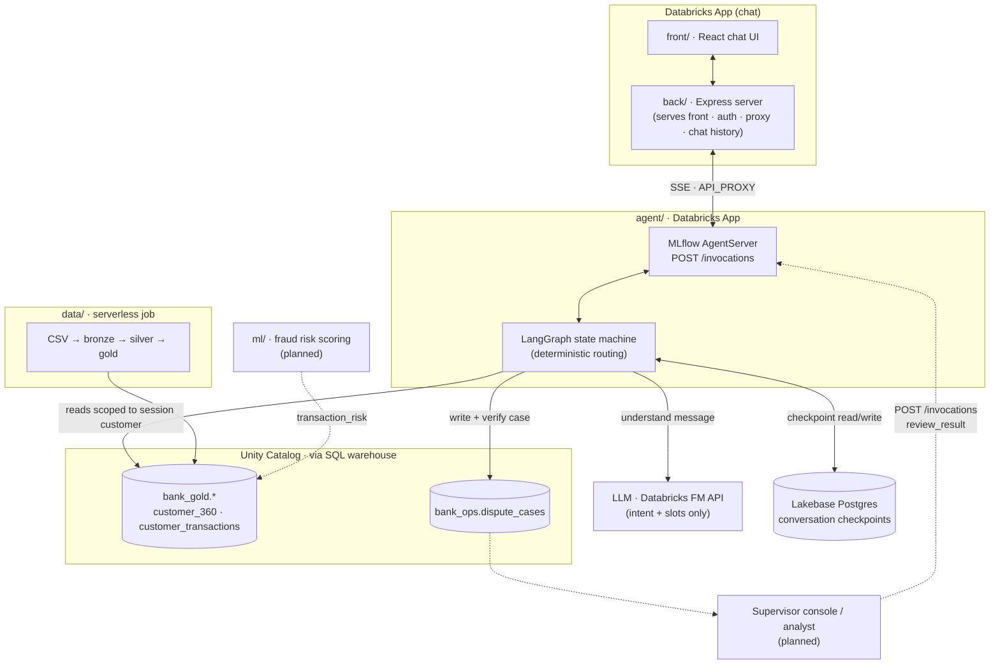

# Bank Assistant: charge-dispute agent

An AI-first customer-service agent for the Factored AI & Data Hackathon 2026. It takes a customer's report of an unrecognized charge (in Spanish or Portuguese), finds the charge, applies a deterministic policy, and either files a case or hands off to a human with full context.

## Architecture



Dashed arrows are designed but not built yet ([docs/agent_architecture.md](docs/agent_architecture.md)).

| Layer | Choice | Why |
|---|---|---|
| Agent control flow | LangGraph graph routed by code (`dispute/graph.py`) | Every transition is named, testable and auditable. LLM output never picks the next step. |
| Understanding | LLM with validated JSON output; keyword baseline as fallback | The model only reads language; policy, permissions and actions stay in code. |
| Data access | SQL warehouse over Unity Catalog, every query filtered by the session's customer | A prompt cannot widen what the agent sees. |
| Checkpointing | Lakebase Postgres via `AsyncCheckpointSaver` (in memory for local dev) | Conversations survive restarts; an external reviewer can write into a paused thread. |
| Human review | Escalated cases carry a handoff packet; the reviewer answers via `/invocations` (planned) | No long-lived sockets; the next turn picks up the decision from the checkpoint. |

## Layout

| Path | What |
|---|---|
| `agent/agent_server/dispute/` | Workflow: session, NLU, policy, data access, graph ([details](agent/DISPUTE_WORKFLOW.md)) |
| `agent/tests/` | Workflow tests |
| `data/` | Data contract, dummy data generator, bronze/silver/gold pipeline ([details](data/README.md)) |
| `front/` | Chat UI (React + Vite) |
| `back/` | Express server for the chat: serves `front/`, auth, chat history, proxies to the agent over HTTP |
| `ml/` | Fraud risk model: features, training, batch scoring ([proposal](docs/ml_fraud_model_proposal.md)) |

## Run

```bash
# Data (once, or after new files)
python data/generate_dummy_data.py
databricks fs cp -r --overwrite data/dummy_output dbfs:/Volumes/workspace/bank_bronze/landing
cd data && databricks bundle deploy && databricks bundle run bank_data_pipeline

# Agent API on http://localhost:8000/invocations (needs agent/.env, see DISPUTE_WORKFLOW.md)
cd agent && uv run start-server

# Chat UI: build front, then back serves it on http://localhost:3000
# (back/.env: DATABRICKS_CONFIG_PROFILE, API_PROXY=http://localhost:8000/invocations)
cd front && npm install && npm run build
cd back && npm install && npm run build && npm run start
# UI dev with hot reload: `npm run dev` in back (port 3001) and in front (port 3000)

# Tests
cd agent && uv run --group dev pytest tests -q
```

## License

Derived from the Databricks [banking-agent-accelerator](https://github.com/databricks-industry-solutions/banking-agent-accelerator) and modified by the team. See [LICENSE.md](LICENSE.md) and [NOTICE.md](NOTICE.md).
