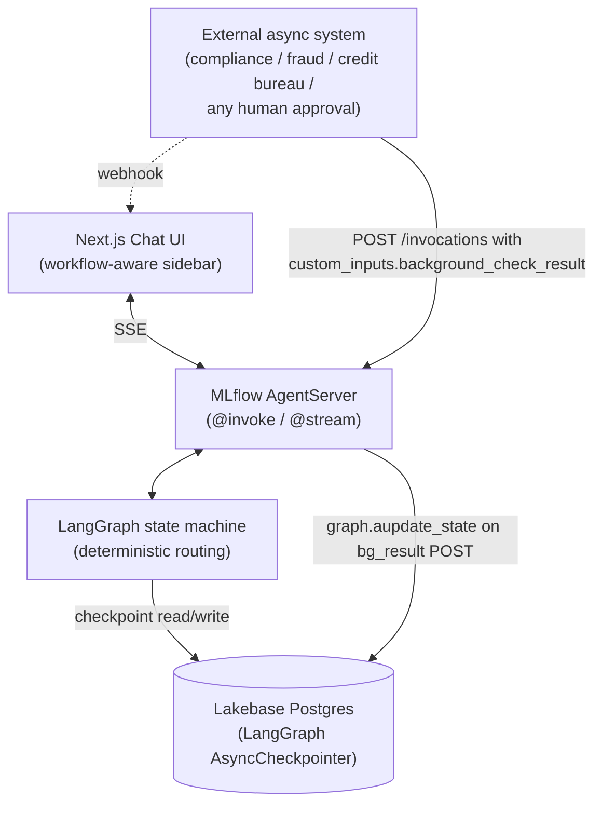

# Bank Assistant: charge-dispute agent

An AI-first customer-service agent for the Factored AI & Data Hackathon 2026. It takes a customer's report of an unrecognized charge (in Spanish or Portuguese), finds the charge, applies a deterministic policy, and either files a case or hands off to a human with full context.

## Architecture



Three architectural choices make this work:

| Layer | Choice | Why |
|---|---|---|
| Agent control flow | LangGraph with `_route_by_stage` conditional edge | Every transition is named, testable, and auditable. LLM output never changes the graph's next step. |
| Checkpointing | Databricks Lakebase Postgres via `AsyncCheckpointSaver` | Serverless managed Postgres; survives restarts; supports concurrent async writes from external systems. |
| HIL resume | External system POSTs the result to `/invocations`; the handler calls `graph.aupdate_state()` to write into Lakebase and fires an internal webhook to the chat UI | No long-lived sockets, no polling; the next user message picks up the injected result from the checkpoint. |

## Layout

| Path | What |
|---|---|
| `agent_app/agent_server/dispute/` | Workflow: session, NLU, policy, data access, graph ([details](agent_app/DISPUTE_WORKFLOW.md)) |
| `agent_app/tests/` | Workflow tests |
| `data/` | Data contract, dummy data generator, bronze/silver/gold pipeline ([details](data/README.md)) |
| `agent_app/e2e-chatbot-app-next/` | Chat UI |

## Run

```bash
# Data (once, or after new files)
python data/generate_dummy_data.py
databricks fs cp -r --overwrite data/dummy_output dbfs:/Volumes/workspace/bank_bronze/landing
cd data && databricks bundle deploy && databricks bundle run bank_data_pipeline

# Agent + chat UI on http://localhost:8000 (needs agent_app/.env, see DISPUTE_WORKFLOW.md)
cd agent_app && uv run start-app

# Tests
cd agent_app && uv run --group dev pytest tests -q
```

## License

Derived from the Databricks [banking-agent-accelerator](https://github.com/databricks-industry-solutions/banking-agent-accelerator) and modified by the team. See [LICENSE.md](LICENSE.md) and [NOTICE.md](NOTICE.md).
