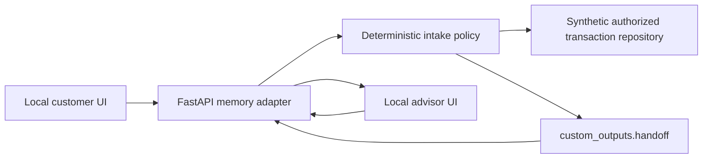

# Local unrecognized-charge integration demo

Status: implemented and tested on 2026-10-04 (America/Lima). This is an offline integration harness with a deterministic intake workflow and synthetic records. It is not a live bank, a trained fraud detector, an LLM evaluation, or a deployed replacement for the existing agent/backend/frontend applications.

## Run

From the repository root, with the local dependencies already installed:

```bash
cd agent
python -m src.local_dispute_demo --port 8010
```

Open **http://127.0.0.1:8010/**. Both the customer chat and advisor console are on the page. Keep the terminal running. Stop with Ctrl+C; all demo conversations disappear on restart. The launcher binds only to loopback and does not load `.env`, initialize Databricks, contact an LLM, or open a database connection.

If dependencies are missing, install the minimal tested set into a disposable local environment using Python 3.13:

```bash
python -m venv /tmp/bank-dispute-demo-venv
/tmp/bank-dispute-demo-venv/bin/python -m pip install -r agent/requirements-local-demo.txt
cd agent
/tmp/bank-dispute-demo-venv/bin/python -m src.local_dispute_demo --port 8010
```

Dependency installation needs package-registry access; running the installed demo requires no network services. Do not run `back/npm run build`, `db:migrate`, `db:push`, or `db:reset` for this demo. It has no database setup step.

## Demonstrate one complete workflow

1. Keep **Cliente A · Español** selected and write `No reconozco un cargo`.
2. Select **Mercado Central · 120.00 USD**. The lookup is limited to the synthetic customer's records.
3. Read the selected charge and press **Confirmar y enviar a revisión**. Selecting alone does not send a request.
4. In the advisor panel, open the request, inspect the verified transaction facts and customer statement, and press **Tomar conversación**.
5. Write an advisor reply and press **Responder en el chat**. It appears in the customer history; subsequent customer messages go to the advisor rather than the intake assistant.
6. Switch to **Cliente B · Português**, write `Não reconheço uma cobrança`, and repeat with **Livraria do Bairro · 75.00 USD**. Customer B cannot access Customer A's movements or conversation.

The customer request is a charge-review intake, not a resolved dispute. The UI never claims the charge is fraudulent, guarantees a refund, or shows the weak model as an individual fraud probability. The advisor's reply is manually written by a person in this demo.

## Architecture and reuse



- [dispute_intake.py](src/dispute_intake.py) separates intake policy, state, and the injected authorized transaction repository. It rechecks ownership and record content on confirmation. Production use needs a real authorized repository and durable backend-owned state.
- [local_dispute_demo.py](src/local_dispute_demo.py) owns synthetic test sessions, conversation state, transactional draft/commit behavior, idempotent retries, the review queue, and advisor messages in process memory.
- [index.html](src/demo_ui/index.html) is a separate local harness. The existing `front/` React UI and `back/` Express server were not changed or started by this delivery.
- Handoff output uses the actual existing provider shape: `reason`, `summary`, and `facts`, carried with `thread_id`, `use_case`, `intent`, `language`, and `blocked`. The existing reason `policy_escalation` is used. `fraud_assessment` explicitly has `status: not_validated`, `risk_score: null`, and `decision_use: false`.
- `/invocations` additionally exposes a Responses-style request/response and SSE contract with `custom_outputs` on the final `response.output_item.done`, matching the metadata location consumed by the existing backend. This is a deterministic local adapter, not the production LLM handler.

The local HTTP/UI flow is connected end to end. Compatibility of the handoff envelope does not mean the original three applications have been fully wired or deployed. The checked-out production agent still needs its complaint workflow/emitter connected. The existing backend's ephemeral mode does not retain human-queue state, so pointing `API_PROXY` at this adapter alone does not replace durable handoff integration.

## API examples

The browser calls `/api/conversations`, `/api/conversations/{id}/turn`, `/api/advisor/queue`, and advisor claim/message routes. Customer identity comes from the fixture session header, never a body `customer_id`. Advisor routes require a different fixture session. Public fixture tokens are intended solely for loopback testing, not production authentication.

To inspect the Responses-style contract:

```bash
curl http://127.0.0.1:8010/invocations \
  -H 'Content-Type: application/json' \
  -d '{"input":[{"role":"user","content":"No reconozco un cargo"}],"custom_inputs":{"session_token":"local-client-es","thread_id":"local-example"},"stream":false}'
```

Use the same thread and session for `Seleccionar DEMO-TX-001`, then `Confirmo la revisión de DEMO-TX-001`. Portuguese equivalents are `Selecionar DEMO-TX-003` and `Confirmo a revisão de DEMO-TX-003` for `local-client-pt`. For separate turns with identical text, include distinct input message IDs/full history; identical input is treated as a retry. The web UI uses explicit actions and confirmation tokens instead of parsing these fixture commands.

## Validation and boundaries

Run the selected suite from `agent/`:

```bash
python -m pytest tests/integration/test_local_dispute_demo.py tests/unit tests/integration/test_graph.py -q
```

The suite covers unauthorized and expired sessions, cross-customer access, forged/stale confirmation, changed records, lookup failure, empty results, injection/sensitive-data handling, cancellation, failed commit with retry, concurrent duplicate confirmation, advisor authorization, and bilingual flows. Local loopback/thread connections must be allowed by the execution environment for FastAPI TestClient.

The original `tests/e2e/test_invocations.py` suite was not included because this environment lacks `databricks_langchain`; the new minimal demo does not need that package. Selected-suite pass counts must not be presented as whole-project test coverage or model precision.

An optional Chrome/Playwright smoke test lives at `tests/browser/local_dispute_demo_smoke.py`. Run it against a freshly started empty demo server after installing `playwright==1.63.0`; it uses an existing `/usr/bin/google-chrome` and does not download a browser. It writes screenshots and browser evidence under `/tmp`.

```bash
python tests/browser/local_dispute_demo_smoke.py
```

Memory-only storage is intentionally disposable, limited to 100 conversations and approximately 200 messages per conversation, and not suitable for durable production workflows. Fixture session headers are an explicit test identity mechanism. The tests do not validate SSO, live banking permissions, LLM quality, financial fraud detection, or monetary actions. No source tables, schemas, UC resources, model endpoints, operational databases, or remote apps are modified.

Evidence: [local validation report](reports/2026-10-04/local_dispute_demo_report.md). Target production contract: [dispute integration](../ml/spec/28-09-26-fraud-model/dispute_integration.md).
