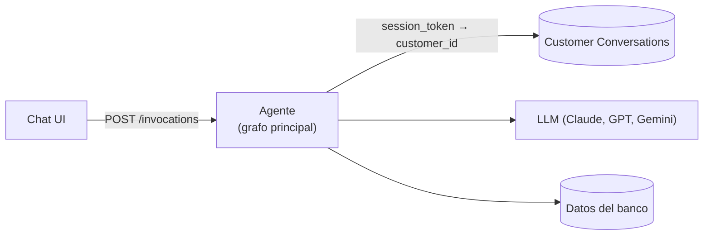
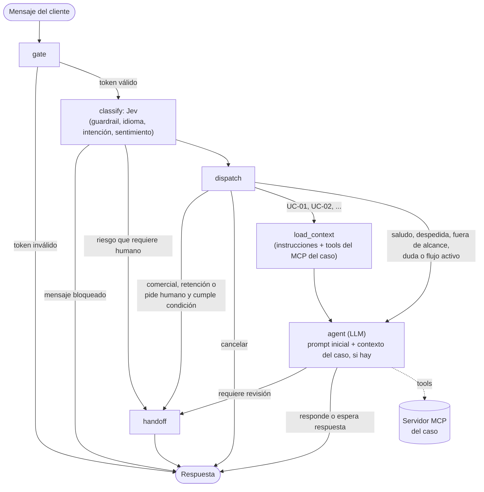

# Agente de atención al cliente

Este documento define qué debe hacer el agente de IA del banco: a quién atiende,
qué casos resuelve, qué nunca hace y cómo se mide si cumple.

## Misión

El agente atiende a clientes de banca minorista en español y portugués. Resuelve
solo las solicitudes rutinarias que la política del banco permite automatizar y
deriva el resto a un humano con todo el contexto, para que el cliente nunca
repita su historia.

## Principales características

-

## Casos de uso

| ID    | Caso                | Acción                                                                                                                               | Volumen | Estado                                    |
| ----- | ------------------- | ------------------------------------------------------------------------------------------------------------------------------------ | ------- | ----------------------------------------- |
| UC-01 | Consultas generales | Responder saldo y límite de tarjeta de crédito y saldo de cuenta de ahorros. Solo lectura.                                           | 57.0%   | Por hacer                                 |
| UC-02 | Quejas              | Registrar la queja, crear el caso y consultar su estado. "Cargo no reconocido" se verifica en las transacciones; el resto se deriva. | 17.1%   | Parcial: cargo no reconocido implementado |
| —     | Técnico             | Por definir: los datos no dicen qué falla. Se cruza con la queja "Problema con app".                                                 | 15.0%   | Candidato                                 |
| —     | Comercial           | Derivar directo a un humano.                                                                                                         | 8.0%    | Derivación a humano                       |
| —     | Retención           | Derivar directo a un humano.                                                                                                         | 3.0%    | Derivación a humano                       |

Los porcentajes son sobre los 686,296 contactos de `call_center_interactions`
(detalle en [docs/02-casos-de-uso.md](docs/02-casos-de-uso.md)). Para UC-01 es
una cota superior: la categoría "Transaccional" también incluye contactos que no
son consultas, y el dataset no los distingue.

## Arquitectura

### Decisiones técnicas

Cada decisión técnica tiene su propio documento en [`docs/`](docs/):

- [Identidad del cliente](docs/01-identidad-de-usuario.md): cómo el agente sabe
  quién es el cliente sin confiar en el texto del chat.
- [Casos de uso](docs/02-casos-de-uso.md): volumen de contactos por categoría y
  qué caso de uso cubre cada una.
- [Casos de uso como MCP](docs/03-casos-de-uso-como-mcp.md): cada caso de uso es
  un servidor MCP independiente con sus instrucciones y herramientas.
- [Guardrails](docs/04-guardrails.md): qué mensajes bloquea o deriva el agente
  antes de procesarlos, y cómo el nodo `classify` resuelve guardrail, idioma e
  intención en una sola llamada a Jev.
- [Dispatch](docs/05-dispatch.md): cómo se elige el caso de uso o el nodo de
  control para cada mensaje, y en qué orden.
- [Política de derivación](docs/06-politica-de-derivacion.md): bajo qué
  condiciones el agente deriva a un humano.
- [Handoff](docs/07-handoff.md): cómo el agente deriva a un humano, dónde queda
  registrado el momento en que deja de atender y qué API usa el asesor.
- [Asignación de asesores](docs/08-asignacion-de-asesores.md): a qué asesor va
  cada handoff según su perfil, y el resumen que recibe.
- [UC-01 Consultas generales](docs/09-consultas-generales.md): cubre solo saldo
  y límite de tarjeta de crédito y saldo de cuenta de ahorros, que son las
  consultas que aparecen en los datos.
- [UC-02 Quejas](docs/10-quejas.md): el agente registra quejas y consulta su
  estado; no las resuelve.
- [Herramientas de implementación](docs/11-herramientas-de-implementacion.md):
  qué servicio de Databricks o librería implementa cada parte del diseño.
- [`customer_id` en las herramientas](docs/12-customer-id-en-herramientas.md):
  cómo el agente agrega el cliente de la sesión a cada herramienta sin que el
  LLM lo vea.
- [Estructura del agente](docs/13-estructura-del-agente.md): carpetas y
  módulos del código.

### Grafo principal

Todos los casos de uso comparten la misma entrada y salida. Solo cambia el flujo
del medio, que es propio de cada caso.

| Nodo           | Qué hace                                                                                                                                                                                                                                                                                | Usa LLM  |
| -------------- | --------------------------------------------------------------------------------------------------------------------------------------------------------------------------------------------------------------------------------------------------------------------------------------- | -------- |
| `gate`         | Valida el token de sesión y carga el perfil del cliente. Con token inválido responde sin leer datos; con token válido pasa el mensaje a Jev.                                                                                                                                            | No       |
| `classify`     | Jev recibe el mensaje antes que cualquier LLM y responde cuatro preguntas: si viola una política (guardrail), en qué idioma está, qué quiere el cliente (intención) y cómo se siente (sentimiento). El código aplica primero el guardrail; la intención solo se usa si el mensaje pasa. | Sí (Jev) |
| `dispatch`     | Si hay un flujo a mitad de camino, manda el mensaje al agente con el contexto ya cargado. Si no, elige el destino según la intención y `routing.yaml`.                                                                                                                                  | No       |
| `load_context` | Suma al agente las instrucciones del caso (`routing.yaml`) y habilita solo las herramientas de su MCP. Al terminar el caso se retiran.                                                                                                                                                  | No       |
| `agent`        | Un solo LLM. Sin caso de uso, responde con su prompt inicial (saludo, despedida, fuera de alcance, aclarar) y presenta las opciones. Con caso de uso, extrae los datos que necesita, consulta con las herramientas del MCP, aplica la política del caso y responde.                     | Sí       |
| `handoff`      | Deriva a un humano con un resumen del caso y lo registra como `Escalated`.                                                                                                                                                                                                              | No       |

## Métricas

Las fichas de comportamiento funcionan como especificación, como tests y como
set de evaluación. Un caso nuevo se integra solo si no empeora las métricas de
seguridad.

| Métrica               | Qué mide                                                                         |
| --------------------- | -------------------------------------------------------------------------------- |
| Resolución automática | Porcentaje de conversaciones resueltas sin humano, dentro de la política.        |
| Calidad de derivación | El resumen contiene todo lo que el asesor necesita.                              |
| Resultados inseguros  | Datos de otro cliente, acciones no verificadas o promesas de dinero. Meta: cero. |
| Latencia              | Tiempo por turno y por creación de caso.                                         |
| Costo                 | Llamadas al LLM por conversación.                                                |

## Pendientes

- [ ] Configurar el login real y la tabla Customer Sessions (hoy los tokens
      están fijos en `src/db/session_repo.py`).
- [ ] Confirmar el catálogo y la prioridad de casos de uso.
- [ ] Escribir `spec.yaml` y fichas para UC-01, UC-03, UC-04 y UC-08.
- [ ] Pasar de un solo grafo a playbooks por caso de uso.
- [ ] Documentar la política completa en `docs/policy.md`: umbrales, qué
      requiere confirmación y qué datos se muestran.
- [ ] Implementar la reanudación tras la revisión del analista.
- [ ] Analizar e implementar la detección de estafas en curso para que no
      dependa solo de Jev (ver
      [Guardrails](docs/04-guardrails.md#44-por-analizar-estafa-en-curso)).
- [ ] Analizar e implementar la atención de varias consultas en una conversación
      (ver [Dispatch](docs/05-dispatch.md#56-por-analizar-varias-consultas)).
- [ ] Analizar un canal de voz: voz a texto y texto a voz alrededor del grafo
      (ver [Herramientas](docs/11-herramientas-de-implementacion.md#111-alcance)).
