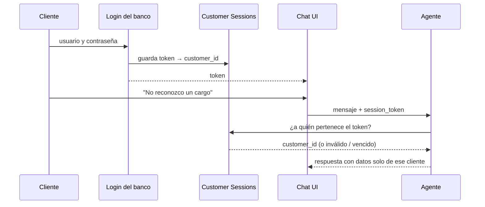

# 1. Identidad del cliente: la sesión

El agente nunca identifica al cliente por lo que escribe en el chat. Si lo
hiciera, cualquiera podría escribir "soy el cliente CLI-123" y ver los datos de
otra persona. La identidad llega por fuera del texto, en un `session_token`:

1. El cliente inicia sesión en la app del banco con su usuario y contraseña. El
   login es del banco, no del agente.
2. El login genera un token aleatorio y lo guarda en **Customer Sessions**
   asociado al cliente: `session_token → customer_id`, con fecha de vencimiento.
3. La UI envía ese token al agente en cada mensaje, en un campo separado del
   texto (`custom_inputs.session_token`).
4. El nodo `gate` busca el token en Customer Sessions y obtiene el
   `customer_id`. Si el token no existe o venció, el agente pide iniciar sesión
   y no lee ningún dato.
5. Todas las consultas del turno filtran por ese `customer_id`.

El cliente nunca ve ni escribe el token, y el texto del chat no puede cambiarlo.
Por eso el agente solo puede mostrar datos del dueño de la sesión.

## 1.1 Estado

Pendiente. Hay que configurar el login real y la tabla Customer Sessions. Hoy
los tokens están fijos en `src/db/session_repo.py`.
