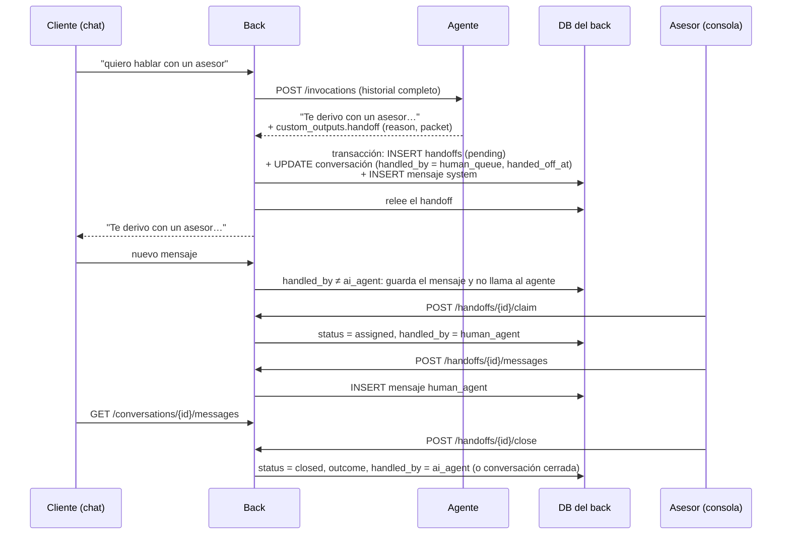

# 7. Handoff: derivación a un humano

El handoff es el momento en que el agente deja de atender una conversación y la
pasa a un asesor humano. Tiene que quedar registrado cuándo pasó, por qué, quién
la tomó y cómo terminó.

## 7.1 Condiciones de derivación

Las condiciones para derivar están en la
[política de derivación](06-politica-de-derivacion.md). Todas llegan al mismo nodo
`handoff`, que solo le avisa al back con `custom_outputs.handoff`; el agente no
escribe en ninguna tabla. El motivo va en `reason` y la condición que se
cumplió, en el `packet`.

A quién se asigna y qué resumen recibe el asesor está en
[Asignación de asesores](08-asignacion-de-asesores.md).

## 7.2 Tablas de registro

Las conversaciones, los mensajes y los handoffs van en **la base del back**
(Postgres local, Lakebase en producción), no en Delta. El back es el único que
las escribe y las lee; el agente no tiene base (ver
[Límites entre el agente y el back](../../docs/limites-agente-back.md)). El chat
y la consola del asesor necesitan verlas al instante; una sentencia por el SQL
warehouse tarda segundos. Para análisis se sincronizan a Delta.

### 7.2.1 `customer_conversations` (campos que usa el handoff)

| Campo           | Qué guarda                                                      |
| --------------- | --------------------------------------------------------------- |
| `handled_by`    | Quién atiende ahora: `ai_agent`, `human_queue` o `human_agent`. |
| `handoff_id`    | El handoff abierto, si hay uno.                                 |
| `handed_off_at` | **Momento exacto en que el agente dejó de atender.**            |

### 7.2.2 `customer_conversation_messages`

Cada handoff agrega un mensaje con `sender_type = system` y el texto del evento
("Derivado a un asesor: customer_request"). Así el historial del chat muestra el
corte. Los mensajes del asesor van con `sender_type = human_agent` y su
`sender_id`.

### 7.2.3 `handoffs`

| Campo               | Qué guarda                                                                                                                                        |
| ------------------- | ------------------------------------------------------------------------------------------------------------------------------------------------- |
| `handoff_id`        | `HND-xxxxxxxxxx`.                                                                                                                                 |
| `conversation_id`   | La conversación derivada.                                                                                                                         |
| `customer_id`       | De la sesión, nunca del chat.                                                                                                                     |
| `case_id`           | El caso del caso de uso, si se creó uno (por ejemplo la disputa `Escalated`).                                                                     |
| `use_case`          | Caso de uso activo al derivar, o `null`.                                                                                                          |
| `reason`            | Motivo, de la política de derivación.                                                                                                                    |
| `mode`              | `take_over`: el asesor responde en el chat. `review`: el asesor decide y el agente comunica.                                                      |
| `priority`          | Calculada por reglas (motivo, monto, segmento).                                                                                                   |
| `packet`            | Resumen para el asesor (JSON): lo que pidió el cliente, datos verificados, reglas que se aplicaron, acciones del agente y preguntas sin resolver. |
| `status`            | `pending` → `assigned` → `closed`.                                                                                                                |
| `requested_at`      | Cuándo se derivó.                                                                                                                                 |
| `assigned_to`       | Asesor que la tomó.                                                                                                                               |
| `assigned_at`       | Cuándo la tomó.                                                                                                                                   |
| `first_response_at` | Primer mensaje del asesor.                                                                                                                        |
| `closed_at`         | Cuándo se cerró.                                                                                                                                  |
| `outcome`           | `resolved`, `returned_to_agent`, `approved` o `rejected` (en modo `review`).                                                                      |
| `note`              | Nota del asesor.                                                                                                                                  |

## 7.3 Mecanismo

1. **El agente solo señala.** Cuando se cumple una condición, `handoff` arma
   el `packet` y responde el texto fijo "te derivo" con
   `custom_outputs.handoff` (`reason` y `packet`). No escribe en ninguna base.
2. **El back guarda en una sola transacción.** El handoff, el cambio de
   `handled_by` y el mensaje `system` se escriben juntos: o quedan los tres o
   ninguno. Un índice único impide dos handoffs abiertos para la misma
   conversación, así que un reintento no duplica nada.
3. **Se relee antes de avisar.** El back le muestra "te derivo" al cliente solo
   si el handoff quedó guardado. Si falla, muestra el mensaje de error actual
   (`handoff_unsaved`) con la línea de atención.
4. **El back deja de llamar al agente.** Mientras `handled_by` no sea
   `ai_agent`, el back guarda los mensajes del cliente y no llama a
   `/invocations`. `gate` ya no revisa `handled_by`.
5. **El asesor responde por la API del back.** Sus mensajes van a la misma
   tabla de mensajes, y el chat los lee de ahí.
6. **Al cerrar**, el asesor elige si la conversación vuelve al agente
   (`handled_by = ai_agent`) o termina. En modo `review` el `outcome` es
   `approved` o `rejected`, y el cliente lo recibe con un texto fijo.

## 7.4 API

Rutas del back (`back/`), no de la App del agente. El agente solo expone
`/invocations`.

| Método y ruta                      | Quién la llama | Qué hace                                                   |
| ---------------------------------- | -------------- | ---------------------------------------------------------- |
| `GET /handoffs?status=pending`     | Consola        | Bandeja de handoffs, ordenada por `priority` y antigüedad. |
| `GET /handoffs/{id}`               | Consola        | El handoff con su `packet` y el historial del chat.        |
| `POST /handoffs/{id}/claim`        | Consola        | El asesor toma un handoff de la cola a mano.               |
| `POST /handoffs/{id}/messages`     | Consola        | El asesor le escribe al cliente.                           |
| `POST /handoffs/{id}/close`        | Consola        | Cierra con `outcome`, `note` y si vuelve al agente.        |
| `GET /conversations/{id}/messages` | Chat UI        | Mensajes nuevos, incluidos los del asesor.                 |

- Las rutas de la consola exigen un usuario del banco: la identidad sale del
  login de Databricks Apps (encabezado `X-Forwarded-Email`) y se valida contra
  un grupo de asesores. `assigned_to` y `sender_id` salen de ahí, nunca del
  cuerpo de la petición.
- La ruta del chat exige la sesión del cliente y solo devuelve conversaciones
  de su `customer_id`.

## 7.5 Métricas

- Tasa de derivación por motivo y por caso de uso.
- Tiempo en cola (`assigned_at - requested_at`) y hasta la primera respuesta.
- Cuántas conversaciones vuelven al agente y cuántas terminan con el asesor.
- Calidad del resumen: el asesor puede marcar si le faltó información.

## 7.6 Estado

Pendiente. Hoy `handoff` guarda un caso `Escalated` en `bank_ops.dispute_cases`
con el resumen en `handoff_json`, y la conversación termina ahí: el agente sigue
respondiendo si el cliente escribe, y no hay consola ni API para el asesor.

Del lado del agente, la Fase 7 se reduce a detectar el handoff y emitir
`custom_outputs.handoff`. Las tablas, la transacción, el corte por `handled_by`
y la API de la consola son trabajo del back.
