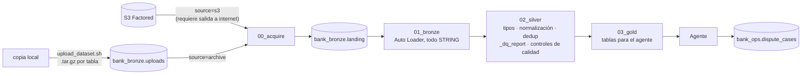

# Data

Documento vivo del frente de datos: qué datos usamos, cómo se procesan, qué sabemos de ellos y qué falta. Se actualiza cada vez que cambia algo en `data/`, `ml/` o en las tablas de Unity Catalog.

- Validación con el dataset real (problemas y acciones): [`docs/data_pipeline_validation.md`](../docs/data_pipeline_validation.md)
- Modelo de fraude: [`docs/ml_fraud_model_proposal.md`](../docs/ml_fraud_model_proposal.md)

## 1. Fuente

| | |
|---|---|
| Origen | Dataset sintético de Factored Datathon 2026, `s3://factored-datathon-2026-s3-157725502942-us-east-2-an/data/` (solo lectura) |
| Contenido | 13 tablas de un banco en México, Colombia y Argentina, del 2023-06-17 al 2026-06-17 |
| Tamaño | 5.1 GB en CSV, 7,671 archivos. Las 6 dimensiones son un CSV cada una; las 7 tablas de hechos vienen en archivos diarios (`year=/month=/day=`) |
| Credenciales | Secret scope `factored-datathon` en Databricks. Nunca en el repo |
| Copia local | `~/factored/hackathon-data/raw/` (fuera del repo) |
| Tipo de dato | Sintético (no hay datos de clientes reales) |

## 2. Arquitectura



Job `bank-assistant-data-pipeline` (serverless) y job de prueba `bank-assistant-data-update-test`. Catálogo `workspace`.

## 3. Tablas

| Esquema | Tablas | Propósito |
|---|---|---|
| `bank_bronze` | las 13 del contrato | Copia cruda, todo STRING, con `_source_file` y `_ingested_at` |
| `bank_silver` | las 13 del contrato + `_dq_report` | Tipos correctos, deduplicado por PK (gana la última versión), país normalizado; `_dq_report` guarda el historial de verificaciones |
| `bank_gold` | `customer_360`, `customer_transactions`, `customer_products`, `customer_cases`, `interaction_history`, `contact_reason_daily` | Tablas para el agente y para el análisis |
| `bank_ops` | `dispute_cases` | Casos que crea el agente (la única tabla que escribe el agente) |

**Uso actual de gold:** el agente lee `customer_360` y `customer_transactions`. `contact_reason_daily` es para el análisis del problema. `customer_products`, `customer_cases` e `interaction_history` están listas pero sin uso todavía.

**Contrato:** `data/pipeline/tables.py` define columnas, tipos, NOT NULL, PK, FK, normalización de valores y umbrales de calidad. Es la fuente única de verdad para el pipeline y para el generador de datos dummy.

## 4. Calidad y política de actualización

- **Controles que bloquean** (en silver): PK nulas, más de 1% de valores imposibles de convertir, una columna NOT NULL ausente, o una tabla sin filas. Cuando uno falla, la tabla conserva su última versión buena y el job se detiene antes de gold.
- **Se reporta sin bloquear:** duplicados de PK (se resuelven quedándose con la última versión), nulos en columnas que no son llave, FK huérfanas, valores normalizados y la fecha más reciente de cada tabla.
- **Actualización:** bronze lee solo archivos nuevos; silver se recalcula completo; las columnas nuevas se agregan solas.
- **Frecuencia:** el dataset es una foto fija, así que el pipeline se corre a demanda, sin horario.
- **Evidencia:** el caso de prueba `90_test_update_correctness` cubre correcciones tardías, duplicados, columnas nuevas e idempotencia. Pasa las 10 verificaciones.

## 5. Lo que sabemos de los datos

| Tema | Hallazgo | Consecuencia |
|---|---|---|
| Volumen | 150k clientes, 400k productos, 4.43M transacciones, 686k interacciones, 171k transcripciones, 213k encuestas, 67k reclamos, 1.75M envíos de campaña, 15.6M eventos digitales | Varios conteos no coinciden con el diccionario |
| Enlaces | Cliente ↔ transacción ↔ producto e interacción ↔ transcripción ↔ encuesta cruzan al 100% | El historial por cliente es confiable |
| Reclamo ↔ llamada | `origin_interaction_id` vacío en el 100%, y no hay otro campo que los enlace | No se puede saber qué llamada originó un reclamo |
| Fraude | `is_fraud` solo existe en transacciones: 4,316 fraudes (0.10%) en 4,233 clientes | Clases muy desbalanceadas; hay que usar métricas adecuadas |
| `fraud_score` | ≥ 70 solo aparece en fraudes | Fuga de información: sirve como baseline, no como variable del modelo |
| Fraude ↔ llamadas | Solo 139 llamadas en los 7 días siguientes a un fraude, con motivos iguales al promedio | Las llamadas no sirven como señal de fraude |
| Motivo de contacto | `contact_reason` = `reason_category`: 6 valores (Transaccional 35%, Producto 22%, Queja 17%, Técnico 15%, Comercial 8%, Retención 3%) | No hay un motivo detallado como "cargo no reconocido" |
| Transcripciones | Plantillas con marcadores sin completar (`{monto} {moneda}`) | No sirven para entrenar un clasificador de texto |
| Monedas | No hay MXN; México opera en USD | La moneda se toma de los productos, no del país |
| Idioma de los valores | Tipos de producto y sentimiento en español; estados y tipos de transacción en inglés | Hay que revisar cada filtro por valor |
| Comercios | Nombres genéricos ("Servicios Públicos", "Cine Premium", "Super Ahorro") | El agente los busca por nombre sin tildes |

## 6. Decisiones

| Fecha | Decisión | Por qué |
|---|---|---|
| 2026-09-25 | Arquitectura medallion (bronze/silver/gold) en Unity Catalog, con contrato en código | Preparación repetible, trazabilidad y controles de calidad, como pide el reto |
| 2026-09-26 | Carga con `.tar.gz` por tabla (`source=archive`) | Free Edition bloquea S3; subir archivo por archivo era lento y se cortaba |
| 2026-09-26 | Los duplicados de PK no bloquean el pipeline | Los reenvíos y las correcciones tardías son legítimos |
| 2026-09-26 | La etiqueta del modelo de fraude es `transactions.is_fraud`, sin usar `fraud_score` como variable | `fraud_score` delata la etiqueta |
| 2026-09-26 | No enlazar reclamos con llamadas | No existe un campo confiable para hacerlo |

## 7. Pendientes

- [ ] **Análisis del problema:** motivos de contacto, demanda por canal y país, resolución en el primer contacto (FCR), escalamiento y sentimiento, a partir de `contact_reason_daily`, `interaction_history` y `complaints`. Sirve para justificar el caso de disputas con datos.
- [ ] **Tabla de variables del modelo de fraude** (`bank_gold` o `bank_ml`), con información disponible al momento de cada transacción, para `ml/`.
- [ ] Actualizar el generador dummy al formato real (tipos en español, IDs `CLI-`) o retirarlo.
- [ ] Decidir si se eliminan de gold las tablas sin uso.
- [ ] Preguntar a Factored por `origin_interaction_id` vacío y por las sucursales huérfanas.

## 8. Cómo correrlo

```
data/
├── pipeline/
│   ├── tables.py                      # contrato: 13 tablas, tipos, NOT NULL, PK, FK, alias de valores, umbrales
│   ├── 00_acquire.py                  # dataset → volume landing (source = s3 | archive | landing)
│   ├── 01_bronze.py                   # Auto Loader incremental, todo STRING, quita BOM, columnas de trazabilidad
│   ├── 02_silver.py                   # tipos, normalización, dedup por PK, _dq_report, controles de calidad
│   ├── 03_gold.py                     # tablas para el agente + bank_ops.dispute_cases
│   └── 90_test_update_correctness.py  # CASO DE PRUEBA: entregas tardías, corregidas, duplicadas, columna nueva
├── scripts/upload_dataset.sh          # copia local → un .tar.gz por tabla en bank_bronze.uploads
├── generate_dummy_data.py             # datos sintéticos con el mismo contrato (tests / trabajo sin conexión)
└── databricks.yml                     # jobs: bank-assistant-data-pipeline, bank-assistant-data-update-test
```

**Cargar el dataset real** (Free Edition bloquea S3 desde serverless, así que pasa por una copia local):

```bash
aws s3 sync s3://factored-datathon-2026-s3-157725502942-us-east-2-an/data/ ~/factored/hackathon-data/raw/
data/scripts/upload_dataset.sh ~/factored/hackathon-data/raw          # ~750 MB comprimido, ~3 min
cd data && databricks bundle deploy
databricks bundle run bank_data_pipeline                             # source=archive (por defecto)
```

- En un workspace con salida a internet no hace falta subir nada: `--params source=s3` copia directo del bucket con las credenciales del secret scope `factored-datathon`.
- `--params reset=true` reconstruye bronze desde cero.
- `databricks bundle run bank_data_update_test` corre el caso de prueba en esquemas aislados `test_update_*`.

**Datos dummy (sin conexión):** `python data/generate_dummy_data.py` → `data/dummy_output/` (en `.gitignore`). Siguen el contrato, pero con tipos de producto en inglés e IDs `CUS…`; los datos reales usan tipos en español e IDs `CLI-…`.

## 9. Historial

| Fecha | Cambio |
|---|---|
| 2026-09-25 | Pipeline inicial con datos dummy: contrato, generador, bronze/silver/gold, `_dq_report` |
| 2026-09-26 | Dataset real descargado y perfilado; 9 correcciones; controles que bloquean; caso de prueba de actualizaciones; carga completa en Databricks; agente probado con clientes reales |
