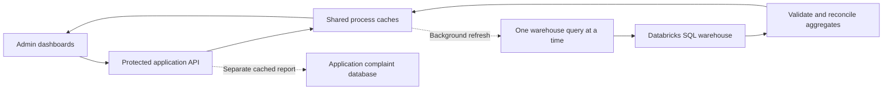

# Admin analytics serving

Fraud and retention dashboards return small, validated reports from backend
memory. An administrator never waits for a warehouse scan inside the dashboard
HTTP request. Both APIs require an authenticated admin session.

## Refresh and failure behavior

| Property | Warehouse reports | Complaint operations |
| --- | --- | --- |
| Refresh interval | 10 minutes, on access | 60 seconds, on access |
| Concurrent queries | One per process across both reports | One per process |
| Cached report limit | Two fixed reports | Eight date/timezone cohorts |
| Forced refresh cooldown | One minute | Ten seconds |
| Maximum retained result age | 24 hours | Five minutes |
| Empty cache | Retention shows preparation; fraud uses labeled historical evidence | Loading state, without zero KPIs |
| Refresh failure | Keep the last validated result within the age limit and show a warning | Keep a valid cached report within the age limit and show a warning |

Refreshes are demand-driven, not scheduled jobs. Concurrent readers share the
same in-flight refresh. Browser API calls have a 15-second timeout; a failed
HTTP refresh keeps an already-loaded dashboard visible with a warning. Browser polling is 2.5 seconds during refresh and 60
seconds otherwise; polling does not itself cause a new scan within the TTL.
Country, priority and chart filters use the cached response locally. Changing
the operational date range uses its own bounded application-database cache.

The source panel separates the last successful query time from the dataset's
reference date. A recently executed query can still read an older supplied
dataset. A failed attempt never advances the successful timestamp. Results
older than the maximum age stop being served as current data. Fraud can still
show its separately labeled, committed historical evidence; retention shows
that no report is available.

## Read boundaries and payloads

Only fixed server-owned SELECT/CTE templates reach the SQL Statements API.
There is no user-supplied SQL. Results are limited to 1,000 rows and 1 MB;
truncated or multi-chunk results are rejected, not treated as complete cohorts.
Authentication waits are bounded to 15 seconds. Warehouse requests have bounded
waits, a 90-second overall client deadline after dequeue, and best-effort
cancellation when a statement ID is available. A cancelled or failed refresh
does not replace a successful report.

Fraud scans only transactions before 2026-01-01, using grouping sets to collect
overview dimensions in one aggregate query. It does not rescore transactions,
retrain models or inspect new final-test labels. Model metrics and integrity
audits remain separate historical evidence. Duplicate-ID counts are not
recomputed by the live overview and must not be reported as a measured zero.

Retention aggregates transaction, interaction and case histories before joining
the customer snapshot, avoiding a row multiplication across fact tables. Only
aggregate indicators and at most 15 pseudonymous customer references per
country/priority leave the warehouse. Names, contact details, original IDs and
raw histories do not enter browser responses. The frontend initially displays
15 shortlist rows, expands locally in groups of 15, and loads dashboard code
only when its route is opened.

Analytics queries do not create or change tables, schemas or source data.
Deployment added only catalog/schema usage and SELECT on the five source tables
to the existing backend service principal. The existing App Runner application
was updated; no separate analytics service or compute was provisioned. Complaint
operations continue to read the existing application database.

## Deployment and scaling boundary

The cache is shared by users **within one backend process**. It is not a durable,
distributed cache: restarts produce a cold cache, and additional replicas have
independent caches. This implementation does not claim a global query limit
across multiple App Runner replicas. A distributed cache or reviewed persisted
report can be introduced later if deployment scale requires it; neither has
been provisioned here.

The deployed application's existing service identity must have warehouse
`CAN USE`, catalog/schema usage and SELECT on the listed Silver/Gold sources.
`BANK_SQL_WAREHOUSE_ID` selects the warehouse; its current default is the
existing warehouse `07ca55766c9c5097`. Credentials remain server-side through
the existing authentication module. Successful owner CLI validation does not
prove that the App Runner service principal has these permissions.

The existing backend/frontend image `928d68f8` was deployed on October 5, 2026.
Actual service OAuth reads, authenticated admin APIs and the published browser
views passed verification. Repeated warm HTTP reads reused the same warehouse
statement IDs. See the [AWS deployment report](../ml/reports/2026-10-05/aws_admin_analytics_report.md)
for permissions, aggregate counts and measured HTTP timings. These checks do not
establish a production latency SLA or unconditional availability guarantee.

See [retention](admin_retention_dashboard.md), [fraud](admin_fraud_dashboard.md),
and [read-only validation](../ml/reports/2026-10-05/admin_analytics_report.md).
