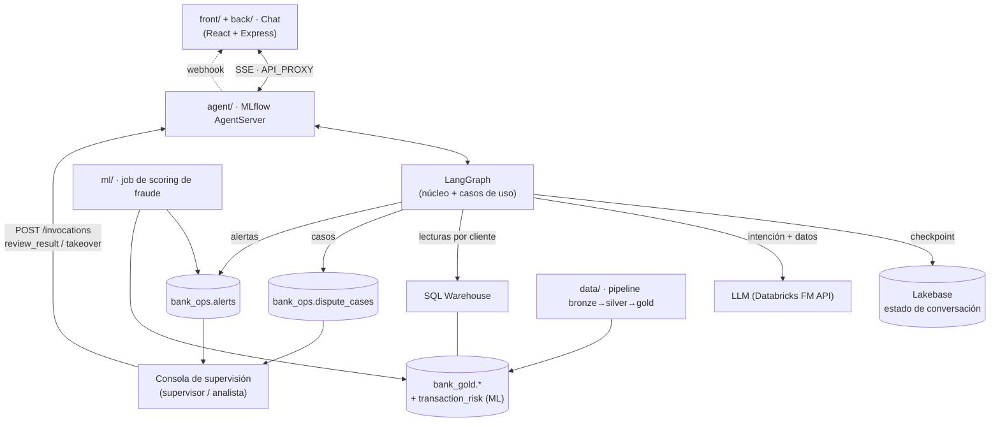
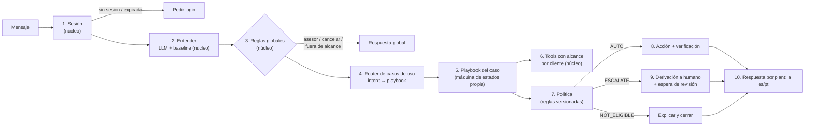
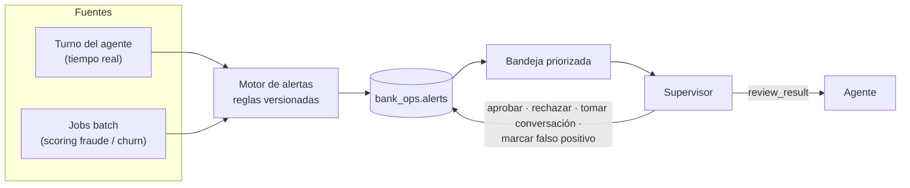
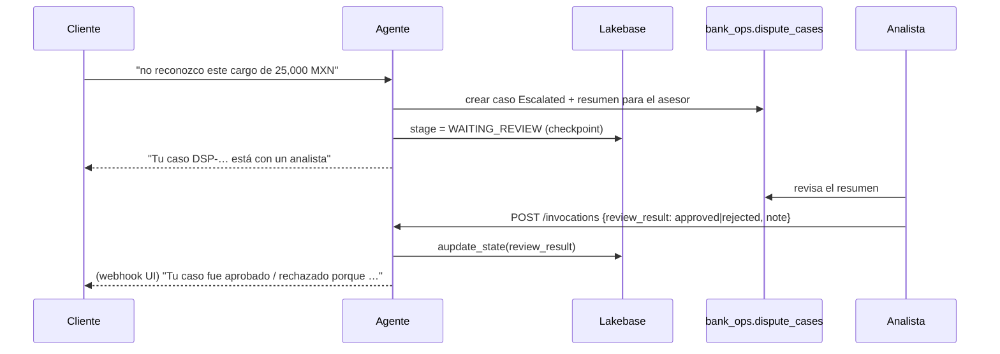

# Arquitectura del agente y modelo de casos de uso

Estado: **propuesta para discutir en el equipo**. El código actual (`agent/agent_server/dispute/`) ya implementa la mayoría de estas piezas para el caso "cargo no reconocido".

## 1. Principios

1. **Un solo dominio, en profundidad:** disputas de cargos. El reto premia la profundidad, no la cantidad de flujos. Cada "caso de uso" es una **variante del dominio de disputas**, no un producto nuevo.
2. **El LLM entiende; el código decide.** El LLM solo clasifica el mensaje y extrae datos. La ruta, los permisos, la política y las acciones son determinísticos.
3. **La identidad viene de la sesión**, nunca del texto del chat. Toda consulta filtra por el `customer_id` de la sesión.
4. **Solo se informan acciones verificadas:** se escribe, se lee de vuelta y recién entonces se le confirma al cliente.
5. **Todo deja rastro:** cada paso queda en `audit` y en las trazas de MLflow. Cada decisión guarda los IDs de las reglas que aplicaron y su versión.

## 2. Vista general



## 3. Qué pasa en cada mensaje

Cada mensaje del cliente recorre las mismas capas. Las marcadas como **núcleo** son compartidas por todos los casos de uso.



### Componentes del núcleo (compartidos)

| Componente | Responsabilidad | Hoy |
|---|---|---|
| `session` | Token → customer_id. Controla expiración y rechazo. | `dispute/session.py` |
| `nlu` | Intención + datos (comercio, monto, fecha, caso). LLM con salida validada y baseline de reglas como respaldo. | `dispute/nlu.py` |
| `global_rules` | Pedir asesor, cancelar, fuera de alcance, saludo. Siempre tienen prioridad. | Dentro de `graph.py` |
| `router` | Envía el mensaje al playbook según la intención. Si hay un playbook en curso, lo mantiene. | Por hacer |
| `tools` | Lecturas y escrituras con `customer_id` obligatorio, reintentos acotados y errores tipados. | `dispute/data.py` |
| `policy` | Motor de reglas: recibe hechos verificados y devuelve `AUTO / ESCALATE / NOT_ELIGIBLE` más los IDs de reglas. | `dispute/policy.py` |
| `cases` | Crea el caso de forma idempotente, lo lee de vuelta y guarda el resumen para el asesor. | En `data.py` y `graph.py` |
| `review` | Espera la decisión del analista y retoma la conversación (sistema externo asíncrono). | Por hacer |
| `i18n` | Plantillas es/pt. Ningún texto sobre dinero o casos es libre. | `dispute/i18n.py` |
| `audit` | Registro de ejecución por turno, con latencias. | `graph.py` |

## 4. Qué es un caso de uso (playbook)

Un caso de uso se agrega como un **playbook**: un paquete con contrato fijo, sin tocar el núcleo.

```
agent_server/usecases/<id>/
├── spec.yaml       # contrato: intención, ejemplos, datos requeridos, tools, reglas, handoff
├── playbook.py     # subgrafo: los pasos específicos del caso
├── rules.py        # reglas de política propias (IDs con prefijo del caso)
└── messages.py     # plantillas es/pt propias
evals/cases/<id>/*.yaml  # fichas de comportamiento esperado (spec + test + evaluación)
```

### `spec.yaml` (contrato)

```yaml
id: UC-03
name: Cargo duplicado
intent: DISPUTE_DUPLICATE
description: El cliente ve el mismo cargo dos veces y quiere que se revierta uno.
examples:
  es: ["me cobraron dos veces lo mismo", "tengo un cargo repetido de Netflix"]
  pt: ["fui cobrado duas vezes", "cobrança duplicada da Uber"]
slots:
  required_any: [merchant, amount, date]
tools: [get_customer, list_transactions, find_open_dispute, create_dispute]
policy_rules: [NE_*, ESC_AMOUNT, ESC_FRAUD_RISK, DUP_SAME_AMOUNT_24H]
outcomes: [AUTO, ESCALATE, NOT_ELIGIBLE, ASK]
never:
  - Afirmar que se hizo un reembolso (no hay movimiento de dinero).
  - Mostrar transacciones de otro cliente.
```

### Ficha de comportamiento (una por escenario)

```yaml
id: UC-03-003
use_case: UC-03
language: pt
session: demo-mx-1
fixture:                 # datos que el escenario necesita (se inyectan en tests)
  transactions:
    - {id: T1, merchant: Uber, amount: 250.0, date: -1, status: Approved}
    - {id: T2, merchant: Uber, amount: 250.0, date: -1, status: Approved}
turns:
  - user: "fui cobrado duas vezes pela Uber ontem"
    expect: {stage: CONFIRM, selected: T2}
  - user: "sim"
    expect: {outcome: AUTO, case_status: Open, rules: [DUP_SAME_AMOUNT_24H]}
must_not: [mentions_refund_done, other_customer_data]
```

Las fichas cumplen tres funciones: **especificación** (qué debe hacer el agente), **test automático** (pytest con datos fijos) y **set de evaluación** (baseline contra LLM, casos inseguros, derivaciones, latencia y costo por caso).

### Pasos para agregar un caso de uso

1. Escribir `spec.yaml` y 5–10 fichas, incluyendo el camino normal, uno ambiguo, uno que se deriva a humano y uno no elegible.
2. Agregar la intención y los ejemplos a `nlu` (el prompt se arma a partir de los `spec.yaml` registrados).
3. Implementar `playbook.py` reutilizando los pasos comunes (buscar transacción, elegir, confirmar, decidir).
4. Agregar las reglas propias en `rules.py` con IDs nuevos. El motor de políticas las carga por caso.
5. Agregar las plantillas en `messages.py`.
6. Correr `pytest` y la evaluación. El caso se integra solo si no empeora las métricas de seguridad.

## 5. Catálogo propuesto

| ID | Caso de uso | Datos que usa | Comportamiento esperado |
|---|---|---|---|
| UC-01 | **Consultas generales** sobre los productos del cliente (tarjeta, ahorros, préstamos) | customer_products, customer_transactions, customer_360 | Responder solo con datos del propio cliente; solo lectura. Ver detalle abajo |
| UC-02 | **Cargo no reconocido** (implementado) | transactions | Buscar → confirmar → caso `Open`, o derivar si hay riesgo |
| UC-03 | **Cargo duplicado** | transactions (mismo comercio y monto en ≤24h) | Detectar el par, confirmar cuál se disputa → caso |
| UC-04 | **"Me cobraron pero fue rechazado"** | transaction_status = Declined/Pending | Explicar con datos que no hubo cobro o que está pendiente → no se crea caso |
| UC-05 | **Reembolso o reverso no recibido** | status = Reversed, merchant | Mostrar el reverso si existe; si no, caso `Open` |
| UC-06 | **Suscripción no cancelada** (Netflix, Spotify…) | cargos recurrentes del mismo comercio | Listar los recurrentes, disputar el último; informar que la cancelación se hace con el comercio |
| UC-07 | **Posible tarjeta comprometida** (varios cargos desconocidos o en otro país) | transactions + `transaction_risk` | Derivación **obligatoria** a fraude con recomendación de bloqueo; el agente no bloquea |
| UC-08 | **Seguimiento de reclamo** ("¿cómo va mi caso?") | dispute_cases, complaints | Mostrar estado y plazo del caso del cliente; nunca de otro cliente |

### UC-01 Consultas generales: preguntas que cubre

| Pregunta del cliente | Tabla | Columnas |
|---|---|---|
| ¿Cuánto debo? / ¿Cuánto tengo? | `customer_products` | `current_balance`, `currency`, `current_balance_usd` |
| ¿Cuál es mi límite? ¿Cuánto cupo me queda? | `customer_products` | `credit_limit`, `credit_utilization` (cupo = límite − saldo) |
| ¿Mi tarjeta está activa? | `customer_products` | `product_status` |
| ¿Cuándo vence? | `customer_products` | `expiration_date` |
| ¿Qué tasa tengo? | `customer_products` | `interest_rate` |
| ¿Estoy atrasado? | `customer_products` | `days_past_due`, `is_delinquent` |
| ¿Cuál es mi tarjeta terminada en 1234? | `customer_products` | `product_number_last4`, `product_type` |
| ¿Cuáles fueron mis últimos movimientos? | `customer_transactions` | fecha, comercio, monto, estado |
| ¿Qué productos tengo? | `customer_360` | perfil y totales del cliente |

- Todo se filtra por el `customer_id` de la sesión confiable.
- **Fuera de alcance:**
  - Tasas, comisiones o requisitos de productos del banco (no hay datos; necesitaría una base de conocimiento).
  - Asesoría financiera (se deriva a un asesor).
  - Operaciones como transferencias, bloqueos o cambios de límite.
- **Límite de los datos:** no hay fecha de pago ni pago mínimo, así que el agente no puede responder "¿cuándo tengo que pagar?".

**Transversales (núcleo, aplican a todos):** pedir asesor, cancelar, fuera de alcance, sesión ausente o expirada, intento de acceder a datos de otro cliente o de inyectar instrucciones, fallas de tools y ambigüedad de idioma.

Prioridad sugerida: UC-01, UC-02, UC-03, UC-04 y UC-08 primero (usan solo datos existentes). UC-07 después del modelo de fraude. UC-05 y UC-06 si alcanza el tiempo.

## 6. Consola de supervisión y alertas

**Usuario:** un supervisor o analista del banco. Los agentes de IA atienden a los clientes; el supervisor usa la consola para vigilarlos y recibe **alertas priorizadas** de los casos que más le importan al banco. La consola es el "external async system" del diagrama: desde ahí se aprueba, se rechaza o se toma la conversación.



### Tipos de alerta

| Tipo | Cuándo se dispara | Fuente | Qué ve el supervisor |
|---|---|---|---|
| **Fraude** | Disputa con `p_fraud ≥ umbral`, varios cargos desconocidos en poco tiempo, o cargo en otro país (UC-07) | `transaction_risk` + flujo de disputa | Transacciones, score y versión del modelo, recomendación (bloqueo) |
| **Riesgo de churn** | Cliente de valor (Premium/Plus) con sentimiento negativo, reclamos repetidos (`is_repeat_complainer`), varias escalaciones o pide cerrar la cuenta | `customer_360`, `interaction_history`, conversación | Historial de contactos, casos abiertos, segmento, motivo |
| **SLA** | Caso escalado sin revisar después de X horas | `dispute_cases` | Tiempo en espera, cliente, monto |
| **Seguridad** | Intento de ver datos de otro cliente, inyección de instrucciones, sesión inválida repetida | `audit` del agente | Mensajes, reglas que lo detectaron |
| **Operativa** | Fallas de tools, latencia alta, tasa de derivaciones fuera de lo normal | `audit` + trazas MLflow | Métrica, periodo, conversaciones afectadas |

### Priorización

`prioridad = severidad del tipo × valor del cliente × urgencia (SLA)`. Es una fórmula determinística y cada alerta guarda sus `reasons` (IDs de reglas y valores), así el supervisor sabe **por qué** está arriba en la lista.

### Acciones del supervisor

- **Aprobar o rechazar** un caso escalado: el agente se lo comunica al cliente (sección 7).
- **Tomar la conversación**: el agente pasa a modo pasivo y el humano responde.
- **Marcar falso positivo o útil**: estas marcas son **etiquetas reales** para mejorar los umbrales y los modelos (fraude y churn).

### Datos

Tabla `bank_ops.alerts`: `alert_id`, `type`, `severity`, `priority`, `customer_id`, `case_id`, `thread_id`, `reasons` (JSON), `status` (`new / in_review / resolved / false_positive`), `created_at`, `handled_by`, `handled_at`, `resolution`. El supervisor ve los datos del cliente enmascarados (últimos 4 dígitos) salvo en el caso que está revisando.

### Alcance para el hackathon

- **Fraude**: completo, con el modelo de `ml_fraud_model_proposal.md`.
- **Churn**: primero con reglas explícitas (señales de `customer_360`). El modelo aprendido queda como trabajo futuro: `customer_status` → Inactive/Closed podría servir de etiqueta, pero hay que validarlo.
- **SLA, seguridad y operativa**: con reglas; salen gratis del `audit` que ya existe.

## 7. Derivación a humano con reanudación (external async system)

Hoy el caso derivado termina en `Escalated`. La propuesta es cerrar el ciclo:



- La decisión del analista queda en el caso (`reviewed_by`, `review_result`, `reviewed_at`).
- Mientras espera, el agente solo responde el estado del caso (UC-08). No acepta cambios.

## 8. Decisiones pendientes

- [ ] Confirmar el catálogo y la prioridad (sección 5).
- [ ] Confirmar el modelo de playbooks (sección 4) contra seguir con un solo grafo con ramas. Recomiendo playbooks: evita que `graph.py` crezca sin control y hace que cada caso se pueda probar por separado.
- [ ] Definir la política completa: umbrales, qué requiere confirmación y qué datos se pueden mostrar (documento aparte, `docs/policy.md`).
- [ ] Implementar la reanudación del analista (sección 7).
- [ ] Consola: página nueva dentro de la App de chat existente (recomendado: un solo deploy y la misma autenticación) o Databricks App separada. Las métricas agregadas pueden ir en un dashboard AI/BI.
- [ ] Umbrales de alertas y capacidad supuesta del equipo de supervisores.
