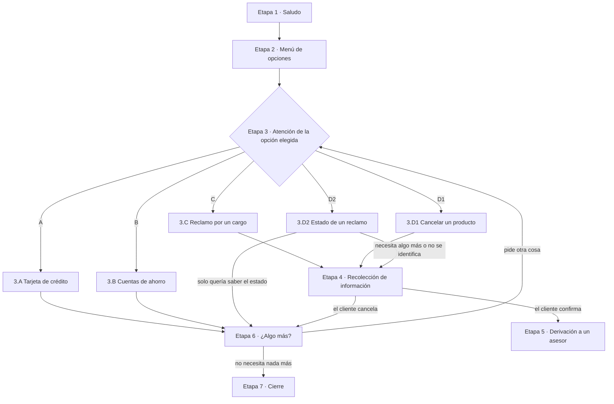
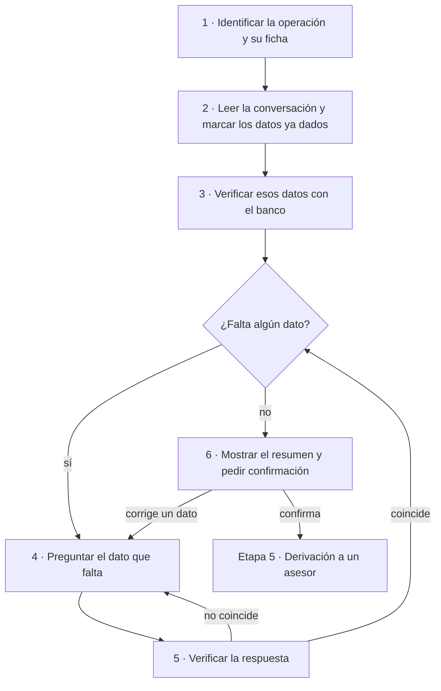
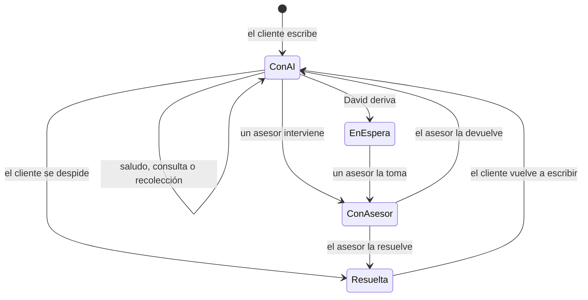

# Flujo de atención: David y los asesores

Estado: **borrador para aprobar**. Una vez aprobado, es la referencia del
agente, el back y el front: cualquier cambio de comportamiento se hace primero
aquí. Quién guarda qué está en
[`limites-agente-back.md`](limites-agente-back.md).

Las marcas **(nuevo)** señalan lo que todavía no está implementado. Todo lo
demás describe cómo funciona hoy.

## 1. Principio

1. David resuelve solo lo que tiene herramientas para resolver.
2. Lo que requiere una persona, David **no lo resuelve ni lo negocia**: primero
   **recolecta proactivamente** la información del caso, la verifica con los
   datos del banco y recién entonces lo deriva. El asesor recibe el caso listo
   para actuar, sin tener que volver a preguntar.
3. Se deriva **por la operación**, nunca por el ánimo del cliente ni porque pida
   hablar con alguien.
4. La **Bandeja** del asesor tiene solo casos humanos. Las conversaciones de
   David están en la vista **Con AI**, por si alguien quiere intervenir.

## 2. Etapas de la conversación

Cada etapa del diagrama tiene una sección con el mismo nombre y número, y cada
sección sigue el mismo formato: **Entra desde**, **Pasos** y **Sale a**.



El cliente puede saltar etapas: si su primer mensaje ya dice qué quiere (por
ejemplo, "¿cuál es mi saldo?"), la conversación empieza directo en la etapa 3.
Las reglas del §3 se aplican en cualquier etapa.

### Etapa 1 · Saludo

**Entra desde:** el primer mensaje del cliente, cuando solo saluda ("hola",
"buenas tardes", "olá").

**Pasos:**

1. David elige el idioma: el del mensaje (español o portugués) o, si no se puede
   saber, el del país del cliente (Brasil, portugués; el resto, español).
2. Saluda y se presenta:

   ```text
   ¡Hola! Soy David, tu asistente virtual del banco.
   ```

**Sale a:** etapa 2.

### Etapa 2 · Menú de opciones

**Entra desde:** la etapa 1, o cuando el cliente escribe "menú" en cualquier
momento, o cuando un mensaje no corresponde a ninguna opción (§3, regla 6).

**Pasos:**

1. David muestra el menú organizado por producto:

   ```text
   Tengo estas opciones para ayudarte:

   A) Tarjeta de crédito: saldo, límite, cupo disponible y movimientos
   B) Cuentas de ahorro: saldo y movimientos
   C) Reclamos: un cargo que no reconoces, un cobro duplicado o un monto distinto
   D) Más opciones: cancelar un producto, estado de un reclamo

   Escribe la letra de tu elección o cuéntame tu consulta.
   ```

2. Espera la elección, por letra o con sus palabras.

**Sale a:** etapa 3, con la opción elegida.

### Etapa 3 · Atención de la opción elegida

**Entra desde:** la etapa 2, la etapa 6, o directo desde el primer mensaje.

**Pasos:** David identifica la opción y sigue los pasos de esa opción (3.A a
3.D2).

**Sale a:** etapa 6 (opciones que David resuelve) o etapa 4 (opciones que van a
una persona).

#### 3.A Tarjeta de crédito

**Entra desde:** etapa 3, opción A. David resuelve solo, con los datos reales
del banco.

**Pasos:**

1. Consulta las tarjetas activas del cliente (`get_products`). Si no tiene
   ninguna, responde `No tienes una tarjeta de crédito activa.`
2. Si el cliente no dijo qué quiere, le ofrece: 1) saldo, límite y cupo, 2)
   movimientos.
3. Según lo que pidió:
   - **Saldo, límite y cupo:** por cada tarjeta, los últimos 4 dígitos, el
     saldo, el límite y el cupo disponible, aunque pregunte solo por uno de
     ellos.
   - **Movimientos:** si tiene más de una tarjeta y no dijo cuál, pregunta cuál.
     Consulta `list_transactions` con esos últimos 4 dígitos y lista los
     últimos 10: fecha, comercio, monto con su moneda y estado.

**Sale a:** etapa 6.

#### 3.B Cuentas de ahorro

**Entra desde:** etapa 3, opción B. David resuelve solo.

**Pasos:**

1. Consulta las cuentas activas del cliente (`get_products`). Si no tiene
   ninguna, responde `No tienes una cuenta de ahorro activa.`
2. Si el cliente no dijo qué quiere, le ofrece: 1) saldo, 2) movimientos.
3. Según lo que pidió:
   - **Saldo:** por cada cuenta, los últimos 4 dígitos y el saldo.
   - **Movimientos:** igual que en 3.A, paso 3.

**Sale a:** etapa 6.

**Reglas de 3.A y 3.B:**

- Solo dice cifras que la herramienta devolvió en ese mismo turno, en la moneda
  del producto y sin convertirlas.
- Si la herramienta falla:

  ```text
  Ahora no puedo consultar esa información.
  ```

- Tarjeta de débito, préstamo, fecha de pago, pago mínimo, deuda total o
  transferencias (los datos del banco no incluyen esa información):

  ```text
  Esa consulta todavía no está disponible en este chat.
  ```

#### 3.C Reclamo por un cargo (nuevo)

**Entra desde:** etapa 3, opción C. David no resuelve el reclamo: recolecta la
ficha y lo deriva.

**Pasos:**

1. David toma esta ficha y pasa a la etapa 4 con motivo `complaint`.

| Dato | Pregunta de David | Cómo lo valida |
| --- | --- | --- |
| Tarjeta | ¿De qué tarjeta es el cargo? | Los últimos 4 dígitos tienen que ser de una tarjeta activa del cliente (`get_products`). Si tiene una sola, la propone. |
| Cargo | ¿Cuál es el cargo? | Le muestra los últimos movimientos de esa tarjeta (`list_transactions`) y el cliente elige uno, o lo describe por comercio, monto o fecha. El cargo tiene que estar en esos movimientos. |
| Tipo | ¿Qué pasó? No lo reconozco / me cobraron dos veces / el monto es distinto | Una de las tres opciones. |
| Descripción | Cuéntame brevemente lo que pasó | Texto libre del cliente. |

**Sale a:** etapa 4.

#### 3.D1 Cancelar un producto (nuevo)

**Entra desde:** etapa 3, opción D1. David no cancela ni intenta retener al
cliente, y no ofrece nada a cambio: aplicar las políticas de retención
(beneficios, cambio de producto, etc.) le corresponde al asesor.

**Pasos:**

1. David toma esta ficha y pasa a la etapa 4 con motivo `retention`.

| Dato | Pregunta de David | Cómo lo valida |
| --- | --- | --- |
| Producto | ¿Qué producto quieres cancelar? | Tipo y últimos 4 dígitos de un producto activo del cliente (`get_products`). Si tiene uno solo, lo propone. |
| Motivo | ¿Por qué quieres cancelarlo? | Texto libre del cliente. |

**Sale a:** etapa 4.

#### 3.D2 Estado de un reclamo (nuevo)

**Entra desde:** etapa 3, opción D2.

**Pasos:**

1. **Usa lo que el banco ya sabe.** El back le pasa los reclamos anteriores del
   cliente, es decir, las conversaciones derivadas con motivo `complaint`:
   fecha, tarjeta, comercio, monto y estado (sin atender, en atención o
   resuelto). Como el agente no guarda estado, el back se los manda en cada
   request, según [`limites-agente-back.md`](limites-agente-back.md).
2. Si hay un solo reclamo, lo propone. Si hay varios, los lista para que elija.

   ```text
   ¿Es el reclamo por el cargo de Uber de $12.90 del 27/09?
   ```

   Si no hay ninguno, o el cliente habla de otro, pasa a la etapa 4 con la
   ficha de abajo.
3. Le dice al cliente el estado que conoce el banco, uno de estos:

   ```text
   Tu reclamo está en la cola de un asesor.
   Un asesor está atendiendo tu reclamo.
   Tu reclamo figura como resuelto.
   ```

4. Pregunta si necesita algo más sobre ese reclamo, por ejemplo un plazo o una
   respuesta.

| Dato | Pregunta de David | Cómo lo valida |
| --- | --- | --- |
| Reclamo | ¿De qué reclamo se trata? (tarjeta, fecha aproximada y comercio o monto) | Si coincide con un reclamo que le pasó el back, lo toma de ahí. Si no, el cargo tiene que estar en los movimientos de esa tarjeta. |
| Qué necesita | ¿Qué necesitas saber de tu reclamo? | Texto libre del cliente. |

**Sale a:** etapa 6 si solo quería saber el estado; etapa 4 con motivo
`case_status` si necesita algo más o si el reclamo no se pudo identificar.

### Etapa 4 · Recolección de información (nuevo)

**Entra desde:** 3.C, 3.D1 o 3.D2, con la ficha de esa opción.

**Pasos:** los números coinciden con el diagrama.



1. **Identificar la operación** y su ficha (3.C, 3.D1 o 3.D2).
2. **Leer toda la conversación** y marcar los datos de la ficha que el cliente
   ya dio. Por ejemplo, en este mensaje ya están la tarjeta, el comercio y el
   tipo:

   ```text
   No reconozco un cargo de Uber en la 1070.
   ```

3. **Verificar** esos datos con los datos del banco (`get_products`,
   `list_transactions`).
4. **Preguntar el primer dato que falta**, uno por vez. Cuando hay opciones
   reales, las muestra: sus tarjetas activas o sus últimos movimientos.
5. **Verificar la respuesta.** Si no coincide (la tarjeta no es suya, el cargo
   no aparece), David lo dice y vuelve al paso 4. Si coincide, vuelve a revisar
   si falta algún dato.
6. **Mostrar el resumen** y pedir confirmación. Si el cliente corrige un dato,
   vuelve al paso 4 con ese dato.

Mientras dura la etapa:

- El agente no guarda estado: en cada turno relee la conversación para saber qué
  operación está en curso y qué datos ya tiene.
- Si el cliente pregunta algo que David resuelve (por ejemplo, su saldo), David
  responde y retoma la pregunta pendiente.
- Si el cliente dice "cancelar" u "olvídalo", David descarta la recolección y no
  deriva:

  ```text
  Listo, lo dejamos ahí. Si necesitas algo más, escríbeme.
  ```

**Sale a:** etapa 5 si el cliente confirma; etapa 6 si cancela.

### Etapa 5 · Derivación a un asesor (nuevo)

**Entra desde:** etapa 4, con la ficha confirmada.

**Pasos:**

1. David le dice al cliente, en su idioma:

   ```text
   Te comunico con un asesor, que ya tiene los datos de tu caso.
   ```

2. David manda al back `custom_outputs.handoff`:
   - `reason`: `complaint`, `retention` o `case_status`.
   - `summary`: 2-3 líneas para el asesor con qué pide el cliente y qué quedó
     verificado. Puede venir vacío si falla la generación; el caso igual se
     deriva.
   - `facts.verified_data`: la ficha confirmada. Las tarjetas van solo con los
     últimos 4 dígitos y nunca se incluyen datos sensibles.
3. El back pasa la conversación a la cola humana (`human_queue`). Aparece en la
   Bandeja como **En espera**, agrupada por su caso de uso.
4. David deja de responder. Los mensajes del cliente le llegan al asesor y el
   chat del cliente muestra:

   ```text
   Te pasamos con un asesor…
   ```

**Sale a:** la atención del asesor (§4).

### Etapa 6 · ¿Algo más?

**Entra desde:** 3.A, 3.B, 3.D2 (solo el estado) o la etapa 4 cancelada.

**Pasos:**

1. David ofrece seguir, por ejemplo, ver los movimientos de una tarjeta o
   volver al menú.

**Sale a:** etapa 3 si el cliente pide otra cosa; etapa 7 si no necesita nada
más.

### Etapa 7 · Cierre

**Entra desde:** etapa 6, o cualquier mensaje de despedida ("gracias, eso es
todo", "adiós", "tchau").

**Pasos:**

1. David se despide con cordialidad.
2. La conversación pasa a **Resueltas**.

**Sale a:** fin. Si el cliente vuelve a escribir, la conversación se reabre y
empieza en la etapa que corresponda.

## 3. Reglas que se aplican en cualquier etapa

Se revisan en este orden, antes de la etapa en la que esté la conversación.

| #   | Regla                                                                                                                                                                                                                                                             | Qué pasa                                                                                                                                                                          |
| --- | ----------------------------------------------------------------------------------------------------------------------------------------------------------------------------------------------------------------------------------------------------------------- | --------------------------------------------------------------------------------------------------------------------------------------------------------------------------------- |
| 1   | La conversación la atiende una persona                                                                                                                                                                                                                            | El back guarda el mensaje y **no llama a David**. Lo responde el asesor.                                                                                                          |
| 2   | La sesión del cliente es inválida o venció                                                                                                                                                                                                                        | Respuesta fija: "Para ayudarte necesito que inicies sesión…" / "No pude verificar tu sesión…" / "Tu sesión expiró…". El turno termina.                                            |
| 3   | El mensaje trae datos sensibles (número de tarjeta, CVV o contraseña)                                                                                                                                                                                             | Respuesta fija: "Por tu seguridad, no compartas el número completo de tu tarjeta…". El dato se enmascara y el turno no se vuelve a mandar a David.                                |
| 4   | Intento de manipular a David ("ignora tus instrucciones"), datos de otra persona, insultos o señales de estafa                                                                                                                                                    | Respuesta fija para cada caso. El turno no se vuelve a mandar a David.                                                                                                            |
| 5   | El cliente dice "cancelar" u "olvídalo"                                                                                                                                                                                                                           | "Listo, lo dejamos ahí…". Se descarta lo que estaba en curso.                                                                                                                     |
| 6   | El mensaje no corresponde a ninguna opción del menú: pide "una persona" o "un asesor" sin una operación concreta, un tema que no es del banco (el clima, un chiste), una operación que el chat no ofrece (transferencias, préstamos) o algo que David no entiende | David dice brevemente que no puede ayudar con eso por aquí y vuelve a mostrar el menú (etapa 2). **Nunca deriva por esto.** Si el cliente elige una opción, sigue con esa opción. |

Además, siempre:

- David es un asistente virtual y lo dice si le preguntan. No firma los
  mensajes.
- Nunca pide datos para "verificar" al cliente: la identidad viene de la sesión.
- Nunca inventa datos de la cuenta, y nunca promete dinero, reversiones ni
  acciones.
- Lo que empieza con `[Asesor]` en el historial lo dijo una persona: David no se
  lo atribuye.
- Antes de pasarle el historial al LLM, David enmascara las tarjetas y los CVV
  de todos los mensajes anteriores.

En la App desplegada no hay salida a internet, así que Jev (el clasificador
externo) no responde: la clasificación y los guardrails usan solo reglas
locales.

## 4. Qué hace el asesor

1. Ve el caso en la Bandeja, con el motivo, el resumen y los datos verificados.
2. Lo **toma**: queda asignado a su nombre y nadie más puede responder. Si otra
   persona lo tiene, ve "La atiende…" y no puede tomarlo.
3. **Responde** al cliente desde la consola y ejecuta lo que corresponde. Por
   ejemplo, en una cancelación aplica las políticas de retención del banco. El
   cliente ve "Asesor", nunca el email del empleado.
4. Termina de una de dos formas:
   - **Resolver**: la conversación pasa a Resueltas.
   - **Devolver a David**: David retoma en el siguiente mensaje del cliente.

También puede entrar a la vista **Con AI** y tomar una conversación para
intervenir, aunque David no la haya derivado.

| Rol     | Qué puede hacer en Chats                                                             |
| ------- | ------------------------------------------------------------------------------------ |
| Asesor  | Tomar, responder, devolver y resolver                                                |
| Admin   | Lo mismo que el asesor, y además ver todas las conversaciones con filtro por usuario |
| Cliente | No tiene acceso                                                                      |

## 5. Estados de una conversación

Toda conversación está siempre en uno de estos cuatro estados. Son los que ve
el asesor en la consola.



| Estado | Qué significa | En el back | Dónde se ve en la consola |
| --- | --- | --- | --- |
| **Con AI** | David la atiende solo | `handledBy = ai_agent` | Vista **Con AI** |
| **En espera** | David la derivó y espera a un asesor | `handledBy = human_queue` | Bandeja y **En espera** |
| **Con asesor** | Un asesor la tomó y la atiende | `handledBy = human_agent` | Bandeja, y **Mías** para quien la tiene |
| **Resuelta** | Terminó, la haya resuelto David (despedida) o un asesor | `closedAt` con fecha | **Resueltas** |

La **Bandeja** del asesor muestra solo **En espera** y **Con asesor**.

## 6. Fuera de alcance (futuro)

- Derivar por frustración, insistencia o riesgo de estafa.
- Operaciones comerciales y otras operaciones humanas que no están en la
  etapa 3.
- Retención hecha por David: siempre la hace el asesor.
- Derivar cuando fallan los datos: David avisa que ahora no puede consultar.
- Rescatar conversaciones abandonadas, asignarlas automáticamente y priorizar la
  bandeja.
- Registrar el reclamo en un sistema de casos del banco: el asesor lo gestiona
  desde la consola.
