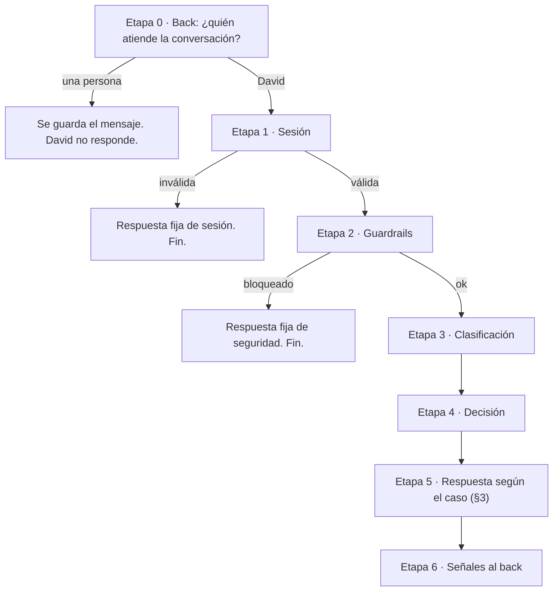
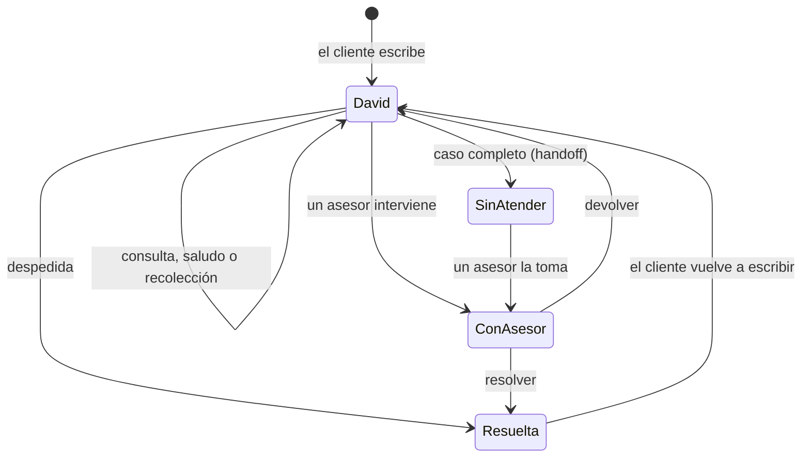

# Flujo de atención: David y los asesores

Estado: **borrador para aprobar**. Una vez aprobado, es la referencia del
agente, el back y el front: cualquier cambio de comportamiento se hace primero
aquí. Quién guarda qué está en
[`limites-agente-back.md`](limites-agente-back.md).

Las marcas **(nuevo)** señalan lo que todavía no está implementado. Todo lo
demás describe cómo funciona hoy.

## 1. Principio

1. David resuelve solo lo que tiene herramientas para resolver.
2. A una persona le llega **solo una operación que requiere una persona**, y le
   llega **con los datos ya recolectados y verificados**.
3. Se deriva **por la operación**, nunca por el ánimo del cliente ni porque pida
   hablar con alguien.
4. La **Bandeja** del asesor tiene solo casos humanos. Las conversaciones de
   David están en **Atendidas por David**, por si alguien quiere intervenir.

## 2. Recorrido de un mensaje

Cada mensaje del cliente pasa por estas etapas, en este orden. El agente no
guarda estado: en cada turno recibe del back todo el historial (máximo los
últimos 20 mensajes) y lo vuelve a leer.

### Etapa 0 · Back: quién atiende

| Condición                                                              | Qué pasa                                                                                                                                                    |
| ---------------------------------------------------------------------- | ----------------------------------------------------------------------------------------------------------------------------------------------------------- |
| La conversación la atiende una persona (`human_queue` o `human_agent`) | El back guarda el mensaje del cliente y **no llama a David**. El asesor lo ve en la consola.                                                                |
| La atiende David (`ai_agent`)                                          | El back manda a David el historial, sin los turnos bloqueados. Los mensajes del asesor van con el prefijo `[Asesor] ` y los avisos de sistema no se mandan. |
| La conversación estaba resuelta                                        | Se reabre y la atiende David.                                                                                                                               |

### Etapa 1 · Sesión

El token del cliente demo tiene que existir y no estar vencido.

| Resultado      | Respuesta fija de David                                               |
| -------------- | --------------------------------------------------------------------- |
| Sin token      | "Para ayudarte necesito que inicies sesión en la banca digital…"      |
| Token inválido | "No pude verificar tu sesión…"                                        |
| Token vencido  | "Tu sesión expiró. Vuelve a iniciar sesión y retomamos tu solicitud." |

Con cualquiera de estos resultados, el turno termina aquí.

### Etapa 2 · Guardrails

Primero se aplican reglas locales al último mensaje. Si no disparan, lo evalúa
Jev. Un turno se bloquea si la categoría no es `OK` y la probabilidad es de al
menos **0,7**.

| Categoría                  | Cómo se detecta                                                                                  | Respuesta fija                                                                                        |
| -------------------------- | ------------------------------------------------------------------------------------------------ | ----------------------------------------------------------------------------------------------------- |
| Datos sensibles            | Regla: número de tarjeta válido (13-19 dígitos) o valor después de "cvv", "contraseña" o "senha" | "Por tu seguridad, no compartas el número completo de tu tarjeta…". El mensaje se guarda enmascarado. |
| Inyección de instrucciones | Regla ("ignora tus instrucciones"…) o Jev                                                        | "No puedo seguir instrucciones que vengan dentro de un mensaje…"                                      |
| Datos de terceros          | Jev                                                                                              | "Solo puedo ver y compartir información de tu propia cuenta…"                                         |
| Abuso                      | Jev                                                                                              | "Quiero ayudarte, pero necesito que sigamos la conversación con respeto."                             |
| Riesgo de estafa           | Jev                                                                                              | "Esto suena a una posible estafa en curso…"                                                           |

Un turno bloqueado queda visible en el chat, pero el back no lo vuelve a mandar
en el historial. Además, en cada turno David enmascara las tarjetas y los CVV de
todos los mensajes anteriores antes de pasarlos al LLM.

En la App desplegada no hay salida a internet, así que Jev no responde y solo
aplican las reglas locales.

### Etapa 3 · Clasificación

Jev devuelve la intención, su confianza, el idioma y el sentimiento del último
mensaje. Sin Jev, las reglas locales clasifican por palabras clave.

| Intención              | Qué significa                                            |
| ---------------------- | -------------------------------------------------------- |
| `GENERAL_INQUIRY`      | Saldo, límite, cupo o movimientos                        |
| `COMPLAINT`            | Reclamo por un cargo                                     |
| `RETENTION`            | Cancelar un producto o cerrar la cuenta                  |
| `HUMAN_AGENT`          | Pide hablar con una persona                              |
| `CASE_STATUS`          | Estado de un reclamo ya abierto                          |
| `COMMERCIAL`           | Productos o promociones del banco                        |
| `CANCEL`               | Detener lo que se está haciendo ("cancelar", "olvídalo") |
| `GREETING` / `GOODBYE` | Saludo / despedida                                       |
| `OUT_OF_SCOPE`         | Nada de lo anterior                                      |

**Idioma de la respuesta.** Si el mensaje tiene 3 palabras o más, se usa el
idioma detectado. Si tiene menos, se usa el del último mensaje anterior con 3
palabras o más. Si no hay ninguno, se usa el del país del cliente: Brasil,
portugués; el resto, español.

**Operación en curso (nuevo).** Si hay una recolección abierta (§4) y el mensaje
no trae una intención nueva clara, el turno sigue esa operación. Por ejemplo,
"la de 1070" o "el de Amazon" continúan un reclamo.

### Etapa 4 · Decisión

Se aplica la primera regla que se cumple:

1. Turno bloqueado en la etapa 2: fin.
2. `CANCEL`: David confirma que lo deja ahí y se descarta cualquier recolección
   en curso.
3. Confianza de la intención menor a **0,5**: David pide que aclare y muestra
   las opciones.
4. Operación en curso (nuevo): se sigue la recolección (§4).
5. Según la intención: tabla de §3.

### Etapa 6 · Señales al back

En cada turno David manda `custom_outputs` con `use_case`, `intent`, `language`,
`blocked` y `handoff`.

- El back guarda el caso de uso de la conversación. Un turno sin caso de uso no
  borra el que ya había.
- `intent = GOODBYE`, cuando atiende David: la conversación pasa a
  **Resueltas**.
- `handoff` con datos (nuevo): la conversación pasa a la cola humana (§5).

## 3. Qué hace David según la intención

| Intención                    | Pasos de David                                                                                                                                                                                                                                                                                                                                                                                                                                        | ¿Deriva?           |
| ---------------------------- | ----------------------------------------------------------------------------------------------------------------------------------------------------------------------------------------------------------------------------------------------------------------------------------------------------------------------------------------------------------------------------------------------------------------------------------------------------- | ------------------ |
| `GREETING`                   | Saluda, se presenta como David, el asistente virtual, y lista las opciones: consultar, reclamo, estado de un reclamo.                                                                                                                                                                                                                                                                                                                                 | No                 |
| `GENERAL_INQUIRY`            | 1. Consulta los productos (`get_products`) o los movimientos (`list_transactions`) del cliente. 2. Responde solo con cifras que le devolvió la herramienta en ese turno, en la moneda del producto. Tarjeta: últimos 4, saldo, límite y cupo. Cuenta: últimos 4 y saldo. 3. Si la herramienta falla, dice que ahora no puede consultar. 4. Débito, préstamos, fecha de pago o transferencias: "esa consulta todavía no está disponible en este chat". | No                 |
| `COMPLAINT`                  | Recolección de un reclamo (§4.1).                                                                                                                                                                                                                                                                                                                                                                                                                     | Sí, al completarla |
| `RETENTION`                  | Recolección de una cancelación (§4.2).                                                                                                                                                                                                                                                                                                                                                                                                                | Sí, al completarla |
| `HUMAN_AGENT`                | Pregunta qué necesita (nuevo). Si el cliente pide algo que David resuelve, lo resuelve. Si es una operación de §4, empieza la recolección.                                                                                                                                                                                                                                                                                                            | No, por sí solo    |
| `CASE_STATUS` / `COMMERCIAL` | "Esa opción todavía no está disponible en este chat" y lista las opciones.                                                                                                                                                                                                                                                                                                                                                                            | No                 |
| `OUT_OF_SCOPE`               | Explica que no puede ayudar con eso y lista las opciones. Nunca ofrece operaciones ni manda a otro canal.                                                                                                                                                                                                                                                                                                                                             | No                 |
| `GOODBYE`                    | Se despide. La conversación queda resuelta.                                                                                                                                                                                                                                                                                                                                                                                                           | No                 |
| `CANCEL`                     | "Listo, lo dejamos ahí. Si necesitas algo más, escríbeme."                                                                                                                                                                                                                                                                                                                                                                                            | No                 |

Reglas de David en cualquier respuesta:

- Es un asistente virtual y lo dice si le preguntan. No firma los mensajes.
- Nunca pide datos para "verificar" al cliente: la identidad viene de la sesión.
- Nunca inventa ni asume datos de la cuenta, y nunca promete dinero, reversiones
  ni acciones.
- Lo que empieza con `[Asesor]` lo dijo una persona: no se lo atribuye.

## 4. Recolección antes de derivar (nuevo)

David pregunta **un dato a la vez** y **verifica contra los datos del banco**
cada dato verificable. En cada turno relee la conversación para saber qué
operación está en curso y qué datos ya tiene.

### 4.1 Reclamo por un cargo

| Paso | David pregunta                                                            | Cómo lo valida                                                                                                                                                                             |
| ---- | ------------------------------------------------------------------------- | ------------------------------------------------------------------------------------------------------------------------------------------------------------------------------------------ |
| 1    | ¿De qué tarjeta es el cargo?                                              | Los últimos 4 dígitos tienen que ser de una tarjeta activa del cliente (`get_products`). Si tiene una sola, la propone.                                                                    |
| 2    | ¿Cuál es el cargo?                                                        | Le muestra los últimos movimientos de esa tarjeta (`list_transactions`) y el cliente elige uno, o lo describe por comercio, monto o fecha. El cargo tiene que existir en esos movimientos. |
| 3    | ¿Qué pasó? No lo reconozco / me cobraron dos veces / el monto es distinto | Una de las tres opciones.                                                                                                                                                                  |
| 4    | Contame brevemente lo que pasó                                            | Texto libre del cliente.                                                                                                                                                                   |
| 5    | Confirma el resumen del caso con el cliente                               | Si el cliente corrige algo, vuelve al paso correspondiente.                                                                                                                                |

### 4.2 Cancelación de un producto

| Paso | David pregunta                     | Cómo lo valida                                                                                              |
| ---- | ---------------------------------- | ----------------------------------------------------------------------------------------------------------- |
| 1    | ¿Qué producto quieres cancelar?    | Tipo y últimos 4 dígitos de un producto activo del cliente (`get_products`). Si tiene uno solo, lo propone. |
| 2    | ¿Por qué quieres cancelarlo?       | Texto libre del cliente.                                                                                    |
| 3    | Confirma el resumen con el cliente | Si corrige algo, vuelve al paso correspondiente.                                                            |

### 4.3 Reglas de la recolección

- Si el cliente ya dio un dato antes (por ejemplo, "no reconozco un cargo de
  Uber en la 1070"), David lo toma y no lo vuelve a preguntar.
- Si el cliente pregunta algo que David resuelve (por ejemplo, su saldo), David
  responde y después retoma la pregunta pendiente.
- Si el cliente dice "cancelar", se descarta la recolección y no se deriva.
- Si un dato no se puede verificar (la tarjeta no es suya, el cargo no aparece),
  David lo dice y vuelve a preguntar.
- El caso está **completo** cuando el cliente confirmó el resumen y todos los
  datos verificables coinciden con los datos del banco.

## 5. La derivación (nuevo)

Cuando el caso está completo:

1. David le responde al cliente, en su idioma: "Te comunico con un asesor, que
   ya tiene los datos de tu caso".
2. David manda al back `custom_outputs.handoff`:
   - `reason`: `complaint` o `retention`.
   - `summary`: 2-3 líneas para el asesor, con qué pide el cliente y qué quedó
     verificado. Puede venir vacío si falla la generación; el caso igual se
     deriva.
   - `facts.verified_data`: los datos del §4. Las tarjetas van solo con los
     últimos 4 dígitos y nunca se incluyen datos sensibles.
3. El back pasa la conversación a la cola humana (`human_queue`). Aparece en la
   Bandeja como **Sin atender**, agrupada por su caso de uso.
4. Desde ese momento el back no llama a David (etapa 0). El cliente ve "Te
   pasamos con un asesor…" y sus mensajes le llegan al asesor.

## 6. Qué hace el asesor

1. Ve el caso en la Bandeja, con el motivo, el resumen y los datos verificados.
2. Lo **toma**: queda asignado a su nombre, y nadie más puede responder. Si otra
   persona lo tiene, ve "La atiende…" y no puede tomarlo.
3. **Responde** al cliente desde la consola. El cliente ve "Asesor", nunca el
   email del empleado.
4. Termina de una de dos formas:
   - **Resolver**: la conversación pasa a Resueltas.
   - **Devolver a David**: David vuelve a atender desde el siguiente mensaje del
     cliente.

También puede entrar a **Atendidas por David** y tomar una conversación para
intervenir, aunque David no la haya derivado.

| Rol     | Qué puede hacer en Chats                                                             |
| ------- | ------------------------------------------------------------------------------------ |
| Asesor  | Tomar, responder, devolver y resolver                                                |
| Admin   | Lo mismo que el asesor, y además ver todas las conversaciones con filtro por usuario |
| Cliente | No tiene acceso                                                                      |

## 7. Estados de una conversación

| Estado        | `handledBy`                | Dónde se ve en la consola           |
| ------------- | -------------------------- | ----------------------------------- |
| David         | `ai_agent`                 | Atendidas por David                 |
| Sin atender   | `human_queue`              | Bandeja y Sin atender               |
| Con un asesor | `human_agent`              | Bandeja, y Mías para quien la tiene |
| Resuelta      | cualquiera, con `closedAt` | Resueltas                           |

## 8. Fuera de alcance (futuro)

- Derivar por frustración, insistencia o riesgo de estafa.
- Estado de un reclamo existente, operaciones comerciales y otras operaciones
  humanas fuera de §4.
- Derivar cuando fallan los datos: David avisa que ahora no puede consultar.
- Rescatar conversaciones abandonadas, asignarlas automáticamente y priorizar la
  bandeja.
- Registrar el reclamo en un sistema de casos del banco: el asesor lo gestiona
  desde la consola.
