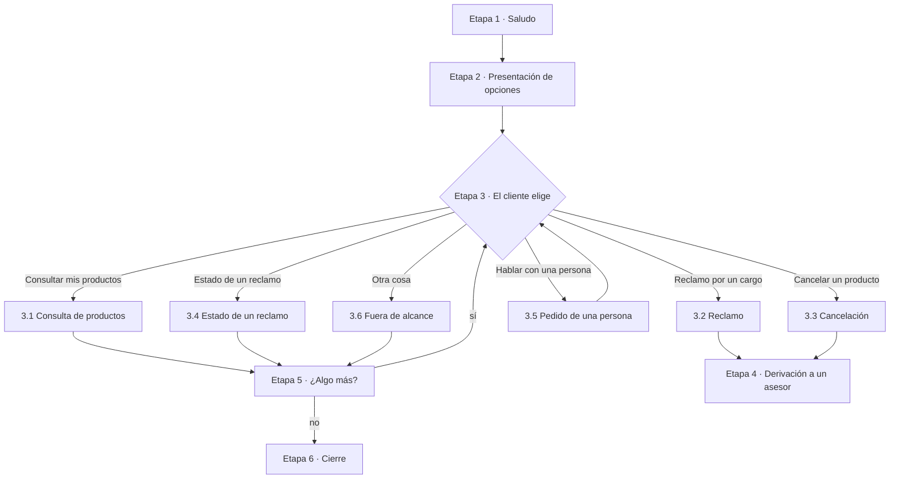
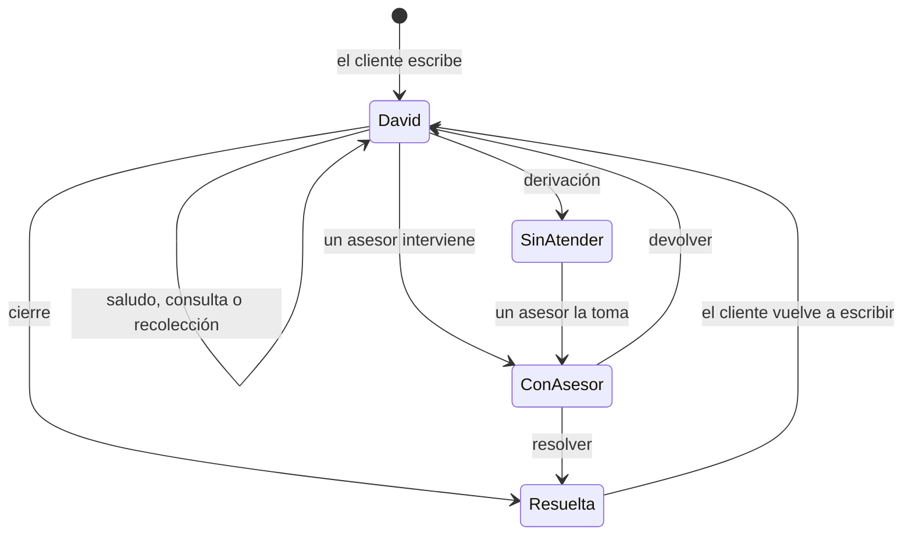

# Flujo de atención: David y los asesores

Estado: **borrador para aprobar**. Una vez aprobado, es la referencia del
agente, el back y el front: cualquier cambio de comportamiento se hace primero
aquí. Quién guarda qué está en [`limites-agente-back.md`](limites-agente-back.md).

Las marcas **(nuevo)** señalan lo que todavía no está implementado. Todo lo
demás describe cómo funciona hoy.

## 1. Principio

1. David resuelve solo lo que tiene herramientas para resolver.
2. A una persona le llega **solo una operación que requiere una persona**, y le
   llega **con los datos ya recolectados y verificados**.
3. Se deriva **por la operación**, nunca por el ánimo del cliente ni porque
   pida hablar con alguien.
4. La **Bandeja** del asesor tiene solo casos humanos. Las conversaciones de
   David están en **Atendidas por David**, por si alguien quiere intervenir.

## 2. Etapas de la conversación

El cliente puede saltar etapas: si su primer mensaje ya dice qué quiere (por
ejemplo, "¿cuál es mi saldo?"), David va directo a esa opción, sin saludo ni
presentación.

### Etapa 1 · Saludo

**Cuándo:** el cliente solo saluda ("hola", "buenas tardes", "olá").

1. David saluda y se presenta: "¡Hola! Soy David, tu asistente virtual del
   banco".
2. Pasa a la etapa 2.

David responde en el idioma del cliente: español o portugués. Si no se puede
saber por el mensaje, usa el del país del cliente: Brasil, portugués; el resto,
español.

### Etapa 2 · Presentación de opciones

1. David lista lo que puede hacer, como opciones numeradas:
   1. Consultar el saldo, el límite o los movimientos de tus tarjetas y cuentas.
   2. Presentar un reclamo, por ejemplo por un cargo que no reconoces.
   3. Cancelar un producto (nuevo).
   4. Ver el estado de un reclamo.
2. Pregunta en qué puede ayudar y espera la respuesta.

El cliente puede elegir por número o con sus palabras.

### Etapa 3 · Atención de la opción elegida

#### 3.1 Consulta de productos

David resuelve solo, con los datos reales del banco. No deriva.

**Paso 1: identificar qué quiere consultar.**

| El cliente pide… | Herramienta |
| --- | --- |
| Saldo, límite o cupo | `get_products` |
| Movimientos | `list_transactions`, filtrando por los últimos 4 dígitos si nombra un producto |

**Paso 2: responder según el tipo de producto.**

| Producto | Qué dice David, por cada producto de ese tipo |
| --- | --- |
| Tarjeta de crédito | Últimos 4 dígitos, saldo, límite y cupo disponible, aunque el cliente pregunte solo por uno de ellos |
| Cuenta de ahorro | Últimos 4 dígitos y saldo |
| Movimientos | Los últimos 10: fecha, producto con sus últimos 4, comercio, monto con su moneda y estado |
| Tarjeta de débito, préstamo, fecha de pago, pago mínimo o transferencias | "Esa consulta todavía no está disponible en este chat" |

**Reglas del paso 2:**

- Solo dice cifras que la herramienta devolvió en ese mismo turno, en la moneda
  del producto, sin convertirlas.
- Si el cliente no tiene productos del tipo que pide: "no tienes una
  [tarjeta/cuenta] activa".
- Si la herramienta falla: "ahora no puedo consultar esa información".

**Paso 3:** ofrece seguir, por ejemplo, ver los movimientos de una tarjeta.
Pasa a la etapa 5.

#### 3.2 Reclamo por un cargo (nuevo)

David recolecta y verifica los datos, y recién entonces deriva. Pregunta **un
dato a la vez**. Si el cliente ya dio un dato, no lo vuelve a preguntar.

| Paso | David pregunta | Cómo lo valida |
| --- | --- | --- |
| 1 | ¿De qué tarjeta es el cargo? | Los últimos 4 dígitos tienen que ser de una tarjeta activa del cliente (`get_products`). Si tiene una sola, la propone. |
| 2 | ¿Cuál es el cargo? | Le muestra los últimos movimientos de esa tarjeta (`list_transactions`) y el cliente elige uno, o lo describe por comercio, monto o fecha. El cargo tiene que estar en esos movimientos. |
| 3 | ¿Qué pasó? No lo reconozco / me cobraron dos veces / el monto es distinto | Una de las tres opciones. |
| 4 | Cuéntame brevemente lo que pasó | Texto libre del cliente. |
| 5 | Confirma el resumen del caso | Si el cliente corrige algo, vuelve al paso correspondiente. |

Con la confirmación, pasa a la etapa 4.

#### 3.3 Cancelación de un producto (nuevo)

| Paso | David pregunta | Cómo lo valida |
| --- | --- | --- |
| 1 | ¿Qué producto quieres cancelar? | Tipo y últimos 4 dígitos de un producto activo del cliente (`get_products`). Si tiene uno solo, lo propone. |
| 2 | ¿Por qué quieres cancelarlo? | Texto libre del cliente. |
| 3 | Confirma el resumen | Si corrige algo, vuelve al paso correspondiente. |

Con la confirmación, pasa a la etapa 4.

#### Reglas de la recolección (3.2 y 3.3)

- El agente no guarda estado: en cada turno relee la conversación para saber
  qué operación está en curso y qué datos ya tiene.
- Si en el medio el cliente pregunta algo que David resuelve (por ejemplo, su
  saldo), David responde y retoma la pregunta pendiente.
- Si un dato no se puede verificar (la tarjeta no es suya, el cargo no
  aparece), David lo dice y vuelve a preguntar.
- Si el cliente dice "cancelar" u "olvídalo", David responde "Listo, lo dejamos
  ahí…", descarta la recolección y no deriva.

#### 3.4 Estado de un reclamo

1. David responde: "Esa opción todavía no está disponible en este chat".
2. Vuelve a la etapa 2.

#### 3.5 Pedido de una persona (nuevo)

1. Si el cliente pide "un asesor" o "una persona" sin decir para qué, David
   pregunta qué necesita. No deriva.
2. Con la respuesta, vuelve a la etapa 3 con la opción que corresponda: si es
   algo que David resuelve, lo resuelve; si es un reclamo o una cancelación,
   empieza la recolección.

#### 3.6 Fuera de alcance

1. Si el cliente pide algo que no es del banco (el clima, un chiste) o una
   operación que no existe en el chat (una transferencia), David dice que no
   puede ayudar con eso. Nunca ofrece hacerlo ni manda a otro canal.
2. Vuelve a la etapa 2.

Si David no entiende el mensaje (confianza menor a 0,5), pide que lo aclare y
vuelve a la etapa 2.

### Etapa 4 · Derivación a un asesor (nuevo)

1. David le dice al cliente, en su idioma: "Te comunico con un asesor, que ya
   tiene los datos de tu caso".
2. David manda al back `custom_outputs.handoff`:
   - `reason`: `complaint` o `retention`.
   - `summary`: 2-3 líneas para el asesor con qué pide el cliente y qué quedó
     verificado. Puede venir vacío si falla la generación; el caso igual se
     deriva.
   - `facts.verified_data`: los datos de 3.2 o 3.3. Las tarjetas van solo con
     los últimos 4 dígitos y nunca se incluyen datos sensibles.
3. El back pasa la conversación a la cola humana (`human_queue`). Aparece en la
   Bandeja como **Sin atender**, agrupada por su caso de uso.
4. Desde ese momento David no responde. El cliente ve "Te pasamos con un
   asesor…", y sus mensajes le llegan al asesor (§4).

### Etapa 5 · ¿Algo más?

1. Después de resolver una consulta, David ofrece seguir.
2. Si el cliente pide otra cosa, vuelve a la etapa 3.
3. Si dice que no, pasa a la etapa 6.

### Etapa 6 · Cierre

**Cuándo:** el cliente se despide ("gracias, eso es todo", "adiós", "tchau").

1. David se despide con cordialidad.
2. La conversación pasa a **Resueltas**.
3. Si el cliente vuelve a escribir, la conversación se reabre y empieza de
   nuevo en la etapa que corresponda.

## 3. Reglas que se aplican en cualquier etapa

Se revisan en este orden, antes de la etapa en la que esté la conversación.

| # | Regla | Qué pasa |
| --- | --- | --- |
| 1 | La conversación la atiende una persona | El back guarda el mensaje y **no llama a David**. Lo responde el asesor. |
| 2 | La sesión del cliente es inválida o venció | Respuesta fija: "Para ayudarte necesito que inicies sesión…" / "No pude verificar tu sesión…" / "Tu sesión expiró…". El turno termina. |
| 3 | El mensaje trae datos sensibles (número de tarjeta, CVV o contraseña) | Respuesta fija: "Por tu seguridad, no compartas el número completo de tu tarjeta…". El dato se enmascara y el turno no se vuelve a mandar a David. |
| 4 | Intento de manipular a David ("ignora tus instrucciones"), datos de otra persona, insultos o señales de estafa | Respuesta fija para cada caso. El turno no se vuelve a mandar a David. |
| 5 | El cliente dice "cancelar" u "olvídalo" | "Listo, lo dejamos ahí…". Se descarta lo que estaba en curso. |

Además, siempre:

- David es un asistente virtual y lo dice si le preguntan. No firma los
  mensajes.
- Nunca pide datos para "verificar" al cliente: la identidad viene de la
  sesión.
- Nunca inventa datos de la cuenta, y nunca promete dinero, reversiones ni
  acciones.
- Lo que empieza con `[Asesor]` en el historial lo dijo una persona: David no
  se lo atribuye.
- Antes de pasarle el historial al LLM, David enmascara las tarjetas y los CVV
  de todos los mensajes anteriores.

En la App desplegada no hay salida a internet, así que Jev (el clasificador
externo) no responde: la clasificación y los guardrails usan solo reglas
locales.

## 4. Qué hace el asesor

1. Ve el caso en la Bandeja, con el motivo, el resumen y los datos verificados.
2. Lo **toma**: queda asignado a su nombre y nadie más puede responder. Si
   otra persona lo tiene, ve "La atiende…" y no puede tomarlo.
3. **Responde** al cliente desde la consola. El cliente ve "Asesor", nunca el
   email del empleado.
4. Termina de una de dos formas:
   - **Resolver**: la conversación pasa a Resueltas.
   - **Devolver a David**: David retoma en el siguiente mensaje del cliente.

También puede entrar a **Atendidas por David** y tomar una conversación para
intervenir, aunque David no la haya derivado.

| Rol | Qué puede hacer en Chats |
| --- | --- |
| Asesor | Tomar, responder, devolver y resolver |
| Admin | Lo mismo que el asesor, y además ver todas las conversaciones con filtro por usuario |
| Cliente | No tiene acceso |

## 5. Estados de una conversación

| Estado | `handledBy` | Dónde se ve en la consola |
| --- | --- | --- |
| David | `ai_agent` | Atendidas por David |
| Sin atender | `human_queue` | Bandeja y Sin atender |
| Con un asesor | `human_agent` | Bandeja, y Mías para quien la tiene |
| Resuelta | cualquiera, con `closedAt` | Resueltas |

## 6. Fuera de alcance (futuro)

- Derivar por frustración, insistencia o riesgo de estafa.
- Estado de un reclamo existente, operaciones comerciales y otras operaciones
  humanas que no están en la etapa 3.
- Derivar cuando fallan los datos: David avisa que ahora no puede consultar.
- Rescatar conversaciones abandonadas, asignarlas automáticamente y priorizar
  la bandeja.
- Registrar el reclamo en un sistema de casos del banco: el asesor lo gestiona
  desde la consola.
