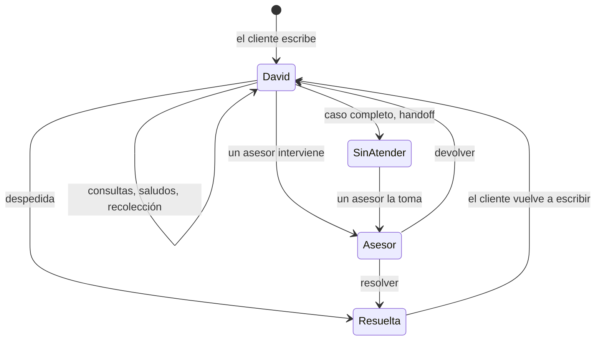

# Flujo de atención: David y los asesores

Estado: **borrador para aprobar**. Una vez aprobado, es la referencia para el
agente, el back y el front. Se complementa con
[`limites-agente-back.md`](limites-agente-back.md), que define quién guarda qué.

## 1. Principio

David (el asistente virtual) resuelve lo que puede resolver solo. A un humano
le llega **solo lo que requiere una persona**, y le llega **con la información
ya recolectada**, para que no pierda tiempo preguntando.

- La **Bandeja** del asesor no es para revisar lo que hace David. Contiene
  casos humanos: conversaciones derivadas o tomadas por una persona.
- Las conversaciones que David atiende solo están en una vista aparte,
  **Atendidas por David**, por si alguien quiere intervenir.
- Se deriva **por la operación** que el cliente quiere hacer, nunca por su
  estado de ánimo ni porque insista en hablar con alguien.

## 2. Roles

| Rol | Asistente | Mis productos | Chats (Bandeja y conversaciones) |
| --- | --- | --- | --- |
| Cliente | Sí | Sí | No |
| Asesor | Sí | No | Atiende: toma, responde, devuelve y resuelve |
| Admin | Sí | Sí | Atiende como el asesor y además ve todo, con filtro por usuario |

Dos personas nunca responden la misma conversación. Si otra persona la tiene,
se ve "La atiende…" y no se puede tomar.

## 3. Qué hace David con cada mensaje

| El cliente quiere… | David | ¿Deriva? |
| --- | --- | --- |
| Saludar, despedirse | Responde | No |
| Consultar saldo, límite, cupo o movimientos (UC-01) | Consulta los datos reales y responde | No |
| Algo fuera del banco (clima, chistes) | Dice qué puede hacer | No |
| Hablar con "un humano" sin decir para qué | Pregunta qué necesita y sigue según la respuesta | No, por sí solo |
| **Presentar un reclamo por un cargo** | Recolecta los datos (§4) | **Sí, al completar** |
| **Cancelar un producto** | Recolecta los datos (§4) | **Sí, al completar** |
| Detener lo que está haciendo ("cancelar", "olvídalo") | Corta la recolección en curso | No |

Si el mensaje no se entiende con suficiente confianza, David pide que lo
aclare.

## 4. Operaciones que van a un humano

David hace **una pregunta a la vez** y **verifica con los datos del banco**
antes de dar un dato por bueno.

### 4.1 Reclamo por un cargo

| Dato | Cómo se obtiene |
| --- | --- |
| Tarjeta | Últimos 4 dígitos, verificados contra los productos del cliente |
| Movimiento | Identificado en los movimientos reales de esa tarjeta: fecha, comercio, monto, moneda y estado |
| Tipo | No lo reconozco / cobro duplicado / monto distinto |
| Descripción | Lo que cuenta el cliente, en sus palabras |

### 4.2 Cancelación de un producto

| Dato | Cómo se obtiene |
| --- | --- |
| Producto | Tipo y últimos 4 dígitos, verificados contra los productos del cliente |
| Motivo | Lo que cuenta el cliente |

### 4.3 Reglas de la recolección

- El agente no guarda estado: en cada turno relee la conversación, detecta qué
  operación está en curso y qué datos ya se dieron, y pide el que falta.
- El caso está **completo** cuando todos los datos obligatorios están y los
  verificables coinciden con los datos del banco.
- Si el cliente cambia de tema a algo que David resuelve (por ejemplo, su
  saldo), David responde y después retoma la recolección.
- Si el cliente dice "cancelar" a mitad de camino, la recolección se descarta y
  no se deriva nada.

## 5. La derivación

Cuando el caso está completo:

1. David le dice al cliente, en su idioma: "Te comunico con un asesor, que ya
   tiene los datos de tu caso".
2. El agente manda al back `custom_outputs.handoff`:
   - `reason`: `complaint` o `retention` (cancelación de producto).
   - `summary`: 2-3 líneas para el asesor (qué pide el cliente y qué quedó
     verificado). Puede venir vacío si falla la generación; el caso igual se
     deriva.
   - `facts.verified_data`: los datos recolectados. Tarjetas solo con los
     últimos 4 dígitos; nunca datos sensibles.
3. El back pasa la conversación a la cola humana (`human_queue`). Aparece en la
   Bandeja como **Sin atender**, agrupada por su caso de uso.
4. Mientras la conversación está en la cola o con una persona, el back no llama
   a David. Los mensajes del cliente se guardan y los ve el asesor.

## 6. Qué hace el asesor

1. Ve el caso en la Bandeja con el motivo, el resumen y los datos verificados.
2. Lo **toma**: queda asignado a su nombre y nadie más puede responder.
3. **Responde** al cliente desde la consola. El cliente ve "Asesor", nunca el
   email del empleado.
4. Termina de dos formas:
   - **Resolver**: la conversación queda en Resueltas.
   - **Devolver a David**: David vuelve a atender. Recibe los mensajes del
     asesor marcados con `[Asesor]` para no atribuírselos.

El asesor también puede entrar a **Atendidas por David** y tomar una
conversación para intervenir, aunque David no la haya derivado.

## 7. Estados de una conversación

| Estado | `handledBy` | Dónde se ve en la consola |
| --- | --- | --- |
| David | `ai_agent` | Atendidas por David |
| Sin atender | `human_queue` | Bandeja, Sin atender |
| Con un asesor | `human_agent` | Bandeja, Mías (del que la tiene) |
| Resuelta | cualquiera, con `closedAt` | Resueltas |

## 8. Fuera de alcance (futuro)

- Derivar por frustración, insistencia o riesgo de fraude.
- Estado de un reclamo existente, operaciones comerciales y otras operaciones
  humanas fuera de §4.
- Derivar cuando fallan los datos: David avisa que ahora no puede consultar.
- Rescate de conversaciones abandonadas por un asesor, asignación automática y
  prioridad de la bandeja.
- Registrar el reclamo en un sistema de casos del banco: el asesor lo gestiona
  desde la consola.
