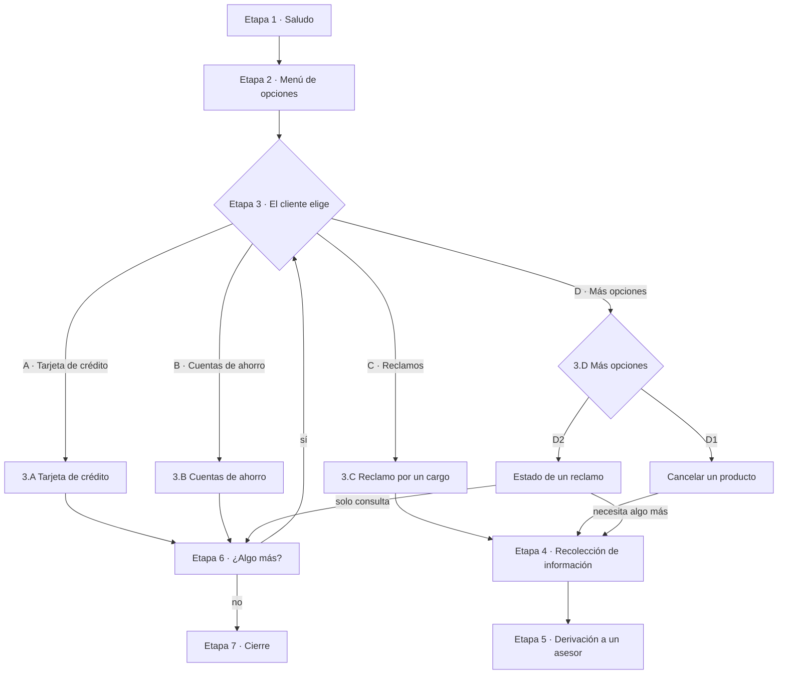
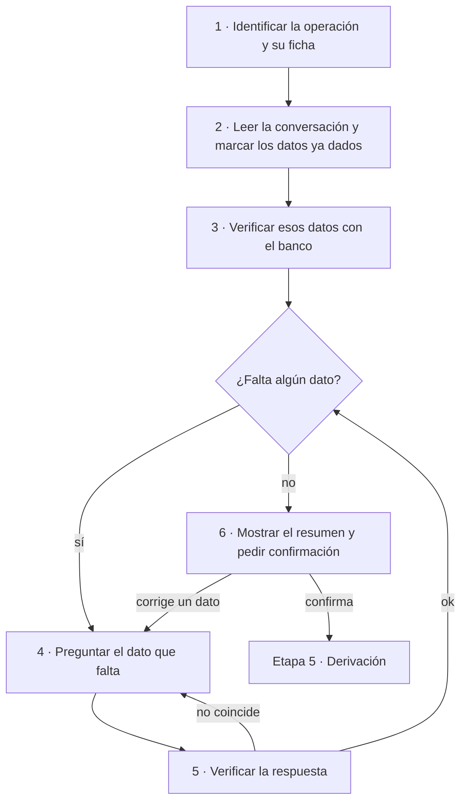
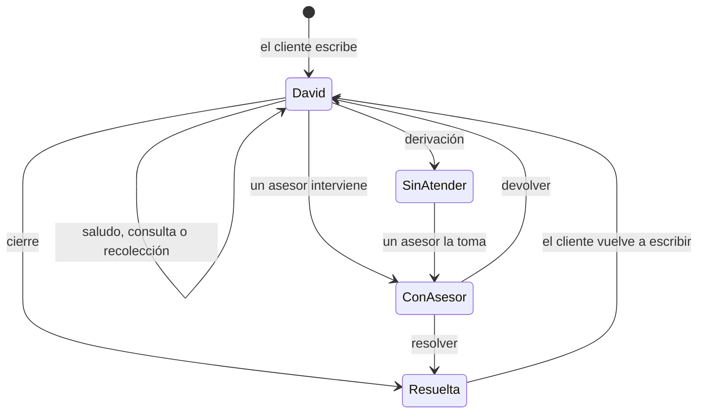

# Flujo de atención: David y los asesores

Estado: **borrador para aprobar**. Una vez aprobado, es la referencia del
agente, el back y el front: cualquier cambio de comportamiento se hace primero
aquí. Quién guarda qué está en
[`limites-agente-back.md`](limites-agente-back.md).

Las marcas **(nuevo)** señalan lo que todavía no está implementado. Todo lo
demás describe cómo funciona hoy.

## 1. Principio

1. David resuelve solo lo que tiene herramientas para resolver.
2. Lo que requiere una persona, David **no lo resuelve ni lo negocia**: primero
   **recolecta proactivamente** la información del caso, la verifica con los
   datos del banco y recién entonces lo deriva. El asesor recibe el caso listo
   para actuar, sin tener que volver a preguntar.
3. Se deriva **por la operación**, nunca por el ánimo del cliente ni porque pida
   hablar con alguien.
4. La **Bandeja** del asesor tiene solo casos humanos. Las conversaciones de
   David están en **Atendidas por David**, por si alguien quiere intervenir.

## 2. Etapas de la conversación

El cliente puede saltar etapas: si su primer mensaje ya dice qué quiere (por
ejemplo, "¿cuál es mi saldo?"), David va directo a esa opción, sin saludo ni
menú.

### Etapa 1 · Saludo

**Cuándo:** el cliente solo saluda ("hola", "buenas tardes", "olá").

1. David saluda y se presenta: "¡Hola! Soy David, tu asistente virtual del
   banco".
2. Pasa a la etapa 2.

David responde en el idioma del cliente: español o portugués. Si no se puede
saber por el mensaje, usa el del país del cliente: Brasil, portugués; el resto,
español.

### Etapa 2 · Menú de opciones (nuevo formato)

David muestra el menú organizado por producto:

> Tengo estas opciones para ayudarte:
>
> **A) Tarjeta de crédito**: saldo, límite, cupo disponible y movimientos **B)
> Cuentas de ahorro**: saldo y movimientos **C) Reclamos**: un cargo que no
> reconoces, un cobro duplicado o un monto distinto **D) Más opciones**:
> cancelar un producto, estado de un reclamo
>
> Escribe la **letra** de tu elección o cuéntame tu consulta.

- El cliente puede elegir por letra o con sus palabras.
- Si escribe "menú" en cualquier momento, David vuelve a mostrarlo.

### Etapa 3 · Atención de la opción elegida

#### 3.A Tarjeta de crédito

David resuelve solo, con los datos reales del banco. No deriva.

| Paso | Qué hace David                                                                                                                                                                                             |
| ---- | ---------------------------------------------------------------------------------------------------------------------------------------------------------------------------------------------------------- |
| 1    | Consulta las tarjetas activas del cliente (`get_products`). Si no tiene ninguna: "no tienes una tarjeta de crédito activa".                                                                                |
| 2    | Si el cliente no dijo qué quiere, le ofrece: 1) saldo, límite y cupo, 2) movimientos.                                                                                                                      |
| 3a   | **Saldo, límite y cupo:** por cada tarjeta, los últimos 4 dígitos, el saldo, el límite y el cupo disponible, aunque pregunte solo por uno de ellos.                                                        |
| 3b   | **Movimientos:** si tiene más de una tarjeta y no dijo cuál, pregunta cuál. Consulta `list_transactions` con esos últimos 4 dígitos y lista los últimos 10: fecha, comercio, monto con su moneda y estado. |
| 4    | Ofrece seguir (etapa 6).                                                                                                                                                                                   |

#### 3.B Cuentas de ahorro

| Paso | Qué hace David                                                                                                           |
| ---- | ------------------------------------------------------------------------------------------------------------------------ |
| 1    | Consulta las cuentas activas del cliente (`get_products`). Si no tiene ninguna: "no tienes una cuenta de ahorro activa". |
| 2    | Si el cliente no dijo qué quiere, le ofrece: 1) saldo, 2) movimientos.                                                   |
| 3a   | **Saldo:** por cada cuenta, los últimos 4 dígitos y el saldo.                                                            |
| 3b   | **Movimientos:** igual que en 3.A, paso 3b.                                                                              |
| 4    | Ofrece seguir (etapa 6).                                                                                                 |

**Reglas de 3.A y 3.B:**

- Solo dice cifras que la herramienta devolvió en ese mismo turno, en la moneda
  del producto y sin convertirlas.
- Si la herramienta falla: "ahora no puedo consultar esa información".
- Tarjeta de débito, préstamo, fecha de pago, pago mínimo, deuda total o
  transferencias: "esa consulta todavía no está disponible en este chat". Los
  datos del banco no incluyen esa información.

#### 3.C Reclamo por un cargo (nuevo)

David no resuelve el reclamo: recolecta esta ficha en la **etapa 4** y lo
deriva con motivo `complaint`.

| Dato | Pregunta de David | Cómo lo valida |
| --- | --- | --- |
| Tarjeta | ¿De qué tarjeta es el cargo? | Los últimos 4 dígitos tienen que ser de una tarjeta activa del cliente (`get_products`). Si tiene una sola, la propone. |
| Cargo | ¿Cuál es el cargo? | Le muestra los últimos movimientos de esa tarjeta (`list_transactions`) y el cliente elige uno, o lo describe por comercio, monto o fecha. El cargo tiene que estar en esos movimientos. |
| Tipo | ¿Qué pasó? No lo reconozco / me cobraron dos veces / el monto es distinto | Una de las tres opciones. |
| Descripción | Cuéntame brevemente lo que pasó | Texto libre del cliente. |

#### 3.D Más opciones

##### D1 · Cancelar un producto (nuevo)

David no cancela ni intenta retener al cliente, y no ofrece nada a cambio:
aplicar las políticas de retención (beneficios, cambio de producto, etc.) le
corresponde al asesor. David recolecta esta ficha en la **etapa 4** y deriva con
motivo `retention`.

| Dato | Pregunta de David | Cómo lo valida |
| --- | --- | --- |
| Producto | ¿Qué producto quieres cancelar? | Tipo y últimos 4 dígitos de un producto activo del cliente (`get_products`). Si tiene uno solo, lo propone. |
| Motivo | ¿Por qué quieres cancelarlo? | Texto libre del cliente. |

##### D2 · Estado de un reclamo (nuevo)

| Paso | Qué hace David |
| --- | --- |
| 1 | **Usa lo que el banco ya sabe.** El back le pasa los reclamos anteriores del cliente, es decir, las conversaciones derivadas con motivo `complaint`: fecha, tarjeta, comercio, monto y estado (sin atender, en atención o resuelto). |
| 2 | Si hay un solo reclamo, lo propone: "¿Es el reclamo por el cargo de Uber de $12.90 del 27/09?". Si hay varios, los lista para que elija. Si no hay ninguno, o el cliente habla de otro, pasa a la etapa 4 con la ficha de abajo. |
| 3 | Le dice al cliente el estado que conoce el banco: "tu reclamo está en la cola de un asesor", "un asesor lo está atendiendo" o "tu reclamo figura como resuelto". |
| 4 | Si el cliente necesita algo más sobre ese reclamo (por ejemplo, un plazo o una respuesta), pasa a la etapa 4 con la ficha de abajo y deriva con motivo `case_status`. Si no, pasa a la etapa 6. |

Ficha para la etapa 4:

| Dato | Pregunta de David | Cómo lo valida |
| --- | --- | --- |
| Reclamo | ¿De qué reclamo se trata? (tarjeta, fecha aproximada y comercio o monto) | Si coincide con un reclamo que le pasó el back, lo toma de ahí. Si no, el cargo tiene que estar en los movimientos de esa tarjeta. |
| Qué necesita | ¿Qué necesitas saber de tu reclamo? | Texto libre del cliente. |

Como el agente no guarda estado, "lo que el banco ya sabe" se lo manda el back
en cada request, según [`limites-agente-back.md`](limites-agente-back.md).

### Etapa 4 · Recolección de información (nuevo)

**Cuándo:** el cliente eligió una operación que requiere una persona (C o D), por
letra o con sus palabras.

1. **Identificar la operación** y su ficha de datos (3.C, D1 o D2).
2. **Leer toda la conversación** y marcar los datos de la ficha que el cliente
   ya dio. Por ejemplo, en "no reconozco un cargo de Uber en la 1070" ya están
   la tarjeta, el comercio y el tipo.
3. **Verificar** esos datos con los datos del banco (`get_products`,
   `list_transactions`).
4. **Preguntar el primer dato que falta**, uno por vez. Cuando hay opciones
   reales, las muestra: sus tarjetas activas o sus últimos movimientos.
5. **Verificar la respuesta.** Si no coincide (la tarjeta no es suya, el cargo
   no aparece), David lo dice y vuelve a preguntar. Si coincide, sigue con el
   próximo dato.
6. Con la ficha completa, **muestra el resumen** y pide confirmación. Si el
   cliente corrige un dato, vuelve al paso 4 con ese dato. Si confirma, pasa a
   la etapa 5.

Reglas de la etapa:

- El agente no guarda estado: en cada turno relee la conversación para saber qué
  operación está en curso y qué datos ya tiene.
- Si en el medio el cliente pregunta algo que David resuelve (por ejemplo, su
  saldo), David responde y retoma la pregunta pendiente.
- Si el cliente dice "cancelar" u "olvídalo", David responde "Listo, lo dejamos
  ahí…", descarta la recolección y no deriva.

### Etapa 5 · Derivación a un asesor (nuevo)

1. David le dice al cliente, en su idioma: "Te comunico con un asesor, que ya
   tiene los datos de tu caso".
2. David manda al back `custom_outputs.handoff`:
   - `reason`: `complaint`, `retention` o `case_status`.
   - `summary`: 2-3 líneas para el asesor con qué pide el cliente y qué quedó
     verificado. Puede venir vacío si falla la generación; el caso igual se
     deriva.
   - `facts.verified_data`: la ficha confirmada en la etapa 4. Las tarjetas van
     solo con los últimos 4 dígitos y nunca se incluyen datos sensibles.
3. El back pasa la conversación a la cola humana (`human_queue`). Aparece en la
   Bandeja como **Sin atender**, agrupada por su caso de uso.
4. Desde ese momento David no responde. El cliente ve "Te pasamos con un
   asesor…", y sus mensajes le llegan al asesor (§4).

### Etapa 6 · ¿Algo más?

1. Después de resolver una consulta, David ofrece seguir.
2. Si el cliente pide otra cosa, vuelve a la etapa 3.
3. Si dice que no, pasa a la etapa 7.

### Etapa 7 · Cierre

**Cuándo:** el cliente se despide ("gracias, eso es todo", "adiós", "tchau").

1. David se despide con cordialidad.
2. La conversación pasa a **Resueltas**.
3. Si el cliente vuelve a escribir, la conversación se reabre y empieza de nuevo
   en la etapa que corresponda.

## 3. Reglas que se aplican en cualquier etapa

Se revisan en este orden, antes de la etapa en la que esté la conversación.

| #   | Regla                                                                                                                                                                                                                                                             | Qué pasa                                                                                                                                                                          |
| --- | ----------------------------------------------------------------------------------------------------------------------------------------------------------------------------------------------------------------------------------------------------------------- | --------------------------------------------------------------------------------------------------------------------------------------------------------------------------------- |
| 1   | La conversación la atiende una persona                                                                                                                                                                                                                            | El back guarda el mensaje y **no llama a David**. Lo responde el asesor.                                                                                                          |
| 2   | La sesión del cliente es inválida o venció                                                                                                                                                                                                                        | Respuesta fija: "Para ayudarte necesito que inicies sesión…" / "No pude verificar tu sesión…" / "Tu sesión expiró…". El turno termina.                                            |
| 3   | El mensaje trae datos sensibles (número de tarjeta, CVV o contraseña)                                                                                                                                                                                             | Respuesta fija: "Por tu seguridad, no compartas el número completo de tu tarjeta…". El dato se enmascara y el turno no se vuelve a mandar a David.                                |
| 4   | Intento de manipular a David ("ignora tus instrucciones"), datos de otra persona, insultos o señales de estafa                                                                                                                                                    | Respuesta fija para cada caso. El turno no se vuelve a mandar a David.                                                                                                            |
| 5   | El cliente dice "cancelar" u "olvídalo"                                                                                                                                                                                                                           | "Listo, lo dejamos ahí…". Se descarta lo que estaba en curso.                                                                                                                     |
| 6   | El mensaje no corresponde a ninguna opción del menú: pide "una persona" o "un asesor" sin una operación concreta, un tema que no es del banco (el clima, un chiste), una operación que el chat no ofrece (transferencias, préstamos) o algo que David no entiende | David dice brevemente que no puede ayudar con eso por aquí y vuelve a mostrar el menú (etapa 2). **Nunca deriva por esto.** Si el cliente elige una opción, sigue con esa opción. |

Además, siempre:

- David es un asistente virtual y lo dice si le preguntan. No firma los
  mensajes.
- Nunca pide datos para "verificar" al cliente: la identidad viene de la sesión.
- Nunca inventa datos de la cuenta, y nunca promete dinero, reversiones ni
  acciones.
- Lo que empieza con `[Asesor]` en el historial lo dijo una persona: David no se
  lo atribuye.
- Antes de pasarle el historial al LLM, David enmascara las tarjetas y los CVV
  de todos los mensajes anteriores.

En la App desplegada no hay salida a internet, así que Jev (el clasificador
externo) no responde: la clasificación y los guardrails usan solo reglas
locales.

## 4. Qué hace el asesor

1. Ve el caso en la Bandeja, con el motivo, el resumen y los datos verificados.
2. Lo **toma**: queda asignado a su nombre y nadie más puede responder. Si otra
   persona lo tiene, ve "La atiende…" y no puede tomarlo.
3. **Responde** al cliente desde la consola y ejecuta lo que corresponde. Por
   ejemplo, en una cancelación aplica las políticas de retención del banco. El
   cliente ve "Asesor", nunca el email del empleado.
4. Termina de una de dos formas:
   - **Resolver**: la conversación pasa a Resueltas.
   - **Devolver a David**: David retoma en el siguiente mensaje del cliente.

También puede entrar a **Atendidas por David** y tomar una conversación para
intervenir, aunque David no la haya derivado.

| Rol     | Qué puede hacer en Chats                                                             |
| ------- | ------------------------------------------------------------------------------------ |
| Asesor  | Tomar, responder, devolver y resolver                                                |
| Admin   | Lo mismo que el asesor, y además ver todas las conversaciones con filtro por usuario |
| Cliente | No tiene acceso                                                                      |

## 5. Estados de una conversación

| Estado        | `handledBy`                | Dónde se ve en la consola           |
| ------------- | -------------------------- | ----------------------------------- |
| David         | `ai_agent`                 | Atendidas por David                 |
| Sin atender   | `human_queue`              | Bandeja y Sin atender               |
| Con un asesor | `human_agent`              | Bandeja, y Mías para quien la tiene |
| Resuelta      | cualquiera, con `closedAt` | Resueltas                           |

## 6. Fuera de alcance (futuro)

- Derivar por frustración, insistencia o riesgo de estafa.
- Operaciones comerciales y otras operaciones humanas que no están en la
  etapa 3.
- Retención hecha por David: siempre la hace el asesor.
- Derivar cuando fallan los datos: David avisa que ahora no puede consultar.
- Rescatar conversaciones abandonadas, asignarlas automáticamente y priorizar la
  bandeja.
- Registrar el reclamo en un sistema de casos del banco: el asesor lo gestiona
  desde la consola.
