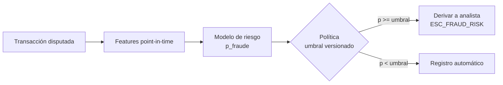

# Propuesta: modelo de riesgo de fraude para el flujo de disputas

Estado: **propuesta**. Hay que validarla con el dataset real de Factored cuando llegue. Con los datos dummy, `is_fraud` es aleatorio, así que solo sirven para probar el pipeline, no para medir el modelo.

## 1. Objetivo

Cuando un cliente disputa un cargo, estimar la **probabilidad de que la transacción sea fraude**. Con esa estimación, la política decide si el caso se deriva a un humano (analista de fraude) o se registra automáticamente.

El modelo **no decide**: solo entrega un riesgo. La decisión la toma la política determinística (`policy.py`) con un umbral versionado. Esto separa la estimación de riesgo de la regla de negocio, como pide el reto:

Hoy la regla es `is_fraud OR fraud_score >= 70` (`ESC_FRAUD_SIGNAL`). El modelo la reemplaza por `p_fraude >= umbral` (`ESC_FRAUD_RISK`).

## 2. Etiqueta

- **Label:** `transactions.is_fraud` (BOOLEAN, NOT NULL).
- **Unidad de predicción:** una transacción.
- **Población:** solo los débitos que se pueden disputar (`Purchase`, `Payment`, `Withdrawal`, `Transfer`), porque es donde se usa el modelo.
- **Por verificar con los datos reales:**
  - la tasa de fraude (se espera un desbalance fuerte);
  - si `is_fraud` se asignó de forma consistente o tiene ruido;
  - si hay fraude "tardío", es decir, transacciones marcadas después de un reclamo.

## 3. Features

Regla principal: **solo información disponible en el momento de la transacción**. Se calculan point-in-time: con eventos estrictamente anteriores a `transaction_date`.

| Grupo | Features | Fuente |
|---|---|---|
| Transacción | monto en USD, log del monto, tipo, canal, categoría del comercio (MCC), hora del día, día de la semana | `transactions` |
| Geografía | país de la transacción ≠ país del cliente, distancia al centro de la ciudad del cliente, distancia a la transacción anterior | `transactions`, `customers` |
| Comportamiento (ventanas 1h / 24h / 7d / 30d) | número de transacciones y monto, z-score del monto contra el histórico del cliente, comercio nuevo para el cliente, país nuevo, velocidad (km/h desde la transacción anterior) | `transactions` (histórico) |
| Cliente | antigüedad, segmento, edad, número de productos | `customers`, `products` (fecha de apertura) |
| Digital | login o error en las 24h previas, país por IP ≠ país del cliente | `digital_events` |

**Excluidas por fuga de información (leakage):**
- `fraud_score`: probablemente se calculó a partir del label o con información posterior. Se usa **solo como baseline**, nunca como feature, salvo que demostremos que existe antes de la transacción.
- `transaction_status` y `response_code`: un rechazo puede ser *consecuencia* de que se detectó el fraude.
- Snapshots de `products` y `customers`: `current_balance`, `days_past_due`, `customer_status` reflejan el estado actual, no el de la fecha de la transacción.
- Todo lo posterior a la transacción: `complaints`, `call_center_interactions`, `satisfaction_surveys`.
- `process_date`: puede llegar tarde (late arrivals) y no refleja cuándo se conoció la transacción.

## 4. Split de evaluación

- **Temporal**, para simular producción:
  - train: jun 2023 – jun 2025;
  - validation: jul 2025 – dic 2025, para elegir modelo y umbral;
  - test: ene 2026 – jun 2026, que se usa **una sola vez** al final.
- **Clientes:** reportar aparte el desempeño en clientes que no aparecen en train, para ver si el modelo generaliza o solo memoriza clientes.
- Duplicados (~2%): se eliminan en silver **antes** de hacer el split, para que la misma transacción no quede en train y en test.

## 5. Baselines y modelos

| ID | Tipo | Descripción |
|---|---|---|
| B0 | Regla | `fraud_score >= 70` (lo que usa hoy el agente) |
| B1 | Regla | Monto alto + país distinto al del cliente + comercio nuevo |
| B2 | Modelo simple | Regresión logística con features de transacción y comportamiento |
| M1 | **Propuesto** | Gradient boosting (LightGBM o `HistGradientBoostingClassifier`) con todas las features, calibrado (isotónica en validation) |

Si B0 le gana a M1 en test, **se reporta así** y el agente sigue usando la regla.

## 6. Métricas

El fraude es poco frecuente, así que el accuracy no sirve. Métricas a reportar:
- **PR-AUC**, que es la métrica principal.
- **Recall a presupuesto de revisión:** qué % del fraude se captura derivando solo el X% de las disputas (X = 5%, 10%, 20%). Refleja la capacidad real del equipo de analistas.
- **Precisión** en el umbral elegido, que indica cuántas derivaciones son innecesarias.
- **Calibración** (Brier score y curva de calibración), porque la política usa la probabilidad directamente.
- **Por subgrupo:** país, segmento, canal y acento detectado. Hay que revisar si hay diferencias grandes de recall o de derivaciones innecesarias entre grupos, e informarlas con el tamaño de cada muestra.

Todo se reporta con intervalos de confianza (bootstrap) y el número de positivos en test.

## 7. Umbral

- Se elige en **validation**, nunca en test.
- Criterio: maximizar el recall de fraude con la restricción de que las derivaciones por riesgo no superen X% de las disputas. X es una capacidad supuesta y documentada, por ejemplo 10%.
- Queda versionado en la política (`dispute-policy-v2`) junto con la versión del modelo. Cambiar el umbral no requiere reentrenar.

## 8. Integración con el agente

1. Un job batch calcula `p_fraude` para las transacciones y la guarda en `bank_gold.transaction_risk` con `transaction_id`, `p_fraud`, `model_version` y `scored_at`.
2. El agente la lee junto con la transacción. **No llama al modelo en línea**, lo que da baja latencia y reproducibilidad.
3. `policy.py` aplica la regla `ESC_FRAUD_RISK`. El caso guarda `p_fraud`, `model_version` y el umbral como evidencia para el analista.
4. Si no hay score, la política usa como respaldo la regla B0 y lo registra (`ESC_NO_RISK_SCORE`).

## 9. MLOps

- Experimentos, métricas y artefactos en MLflow. El modelo se registra en Unity Catalog (`workspace.bank_ml.fraud_risk`) con alias `champion`.
- Entrenamiento reproducible como tarea del bundle `data/`, con semilla fija y versión de datos (versión de la tabla Delta).
- Monitoreo: cómo cambia la distribución de `p_fraud` y de las features principales (PSI), tasa de derivaciones y precisión observada en los casos que revisan los analistas.

## 10. Preguntas abiertas (verificar con los datos reales)

- [ ] Tasa de fraude y número de positivos. ¿Alcanza para el test temporal?
- [ ] ¿`fraud_score` existe antes de la transacción o se deriva del label?
- [ ] ¿El fraude en los datos sintéticos tiene patrones aprendibles (geografía, velocidad, monto) o es aleatorio?
- [ ] ¿Hay relación entre `is_fraud` y `complaints` con categoría de cargos no reconocidos? Serviría para validar la etiqueta.
- [ ] Capacidad de revisión supuesta (X%) y costo de un fraude no detectado frente a una derivación innecesaria.
