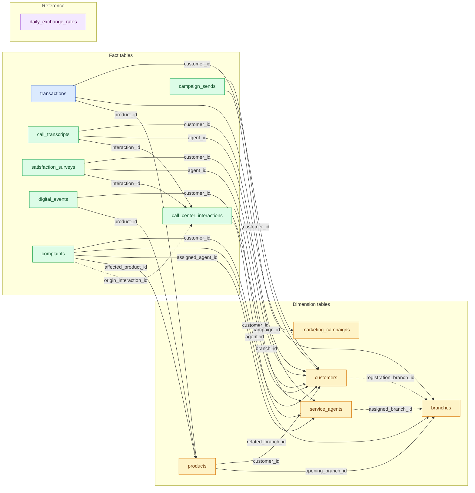
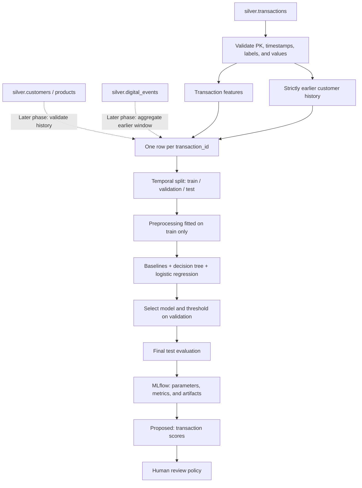

# Data map and initial fraud model design

Status: living design document. The first V1 training comparison completed on 2026-10-02 and was rejected for promotion; see [the Phase 2 report](reports/2026-10-02/training_phase2_report.md). Updated: 2026-10-02.

Implementation specifications: [requirements and models](spec/28-09-26-fraud-model/requirements.md), [plan](spec/28-09-26-fraud-model/plan.md), and [validation](spec/28-09-26-fraud-model/validation.md). The specs make this proposal concrete and take precedence for contracts and acceptance criteria.

## 1. What we want to predict

**One row = one transaction.** Estimate a risk score using information available at `transaction_date`; the evaluation label is `transactions.is_fraud`. The score will support human review of disputed charges. Policy determines actions, not the model.

The first evaluation will cover transactions; do not present it as performance on actual disputes. `complaints` has no `transaction_id`, so an exact join cannot reconstruct a population of disputed transactions. If we restrict eligible transaction types, document the filter and retained positives before training.

## 2. Sources and evidence status

- Supplied documents in `/home/diego/Descargas/documents_factored_hackathon`: **LATAM_Bank_Complete_Data_Dictionary.pdf**, **LATAM_Bank_Dataset_Summary.pdf**, and **Factored AI & Data Hackathon 2026.pdf**. Synthetic dataset covering Mexico/Colombia/Argentina, June 2023–June 2026.
- Schemas and 24 dictionary relationships checked against [the code contract](../data/pipeline/tables.py).
- [Persistent reference for all columns](../docs/fraud_data_reference.md) and [the team's previous validation](../docs/data_pipeline_validation.md).
- Verified through CLI: 13 Delta tables exist in `workspace.bank_silver`, plus `_dq_report`, 6 gold tables, and a successful latest ingestion run.
- Reads with our account remain blocked by `USE SCHEMA`; distributions, missing values, and predictive signal have not been revalidated. Counts of 4,425,008 transactions and 4,316 fraud cases (~0.10%) come from team reports.

## 3. Complete map of the 13 tables

Names represent tables in `workspace.bank_silver`. Each arrow points from child to parent; its label identifies the join column. Parent keys appear in the inventory below. These are logical dictionary relationships, not proof of physically enforced constraints.

- Solid arrow: documented relationship, not necessarily validated with our account.
- Dashed arrow: documented relationship with issues reported by the team.
- `daily_exchange_rates` has no declared FK: its temporal/currency join is described after the diagram.
- Color key: amber = dimension, green = fact, blue = primary model source (`transactions`), purple = reference (no FK).

### Inventory and model role

| Table | Primary key | Proposed role |
|---|---|---|
| `customers` | `customer_id` | Customer context; snapshot attributes require temporal review. |
| `products` | `product_id` | Product context; do not treat current balances/states as historical. |
| `branches` | `branch_id` | Branch context; orphan relationships have been reported. |
| `service_agents` | `agent_id` | Operational context; outside the first model. |
| `marketing_campaigns` | `campaign_id` | Marketing context; outside the first model. |
| `transactions` | `transaction_id` | Primary source and label; behavioral history. |
| `call_center_interactions` | `interaction_id` | Demand analysis; outside the first fraud model. |
| `call_transcripts` | `transcript_id` | Synthetic service text; outside the first model. |
| `satisfaction_surveys` | `survey_id` | Service quality; outside the first model. |
| `digital_events` | `event_id` | Later candidate: activity preceding the transaction. |
| `complaints` | `complaint_id` | Operational context without an exact transaction link; does not create our label. |
| `campaign_sends` | `send_id` | Marketing context; outside the first model. |
| `daily_exchange_rates` | `date, source_currency, target_currency` | Currency conversion if amount_usd cannot be used. |

### Joins requiring care

1. **Transactions → customer/product:** use `customer_id` and `product_id`. Verify that product ownership matches the transaction customer. Preserve one row per `transaction_id` after every join.
2. **Customers and products are snapshots:** `last_updated` does not provide historical versions. An ID join alone does not make segment, country, product type, or balance historically valid. Opening/registration dates require consistency checks.
3. **Digital events → transaction:** no direct FK exists. Use `customer_id` and a strictly earlier window; aggregate before joining rather than multiplying rows with a raw join. Do not infer customer identities for anonymous events.
4. **Exchange rates:** candidate join on `source_currency = transactions.currency`, `target_currency = 'USD'`, and a rate/date available before the decision. The same day's closing rate may be in the future relative to the transaction. Without publication time, declare a conservative convention (latest earlier rate) and do not mix currencies. This is not a dictionary FK.
5. **Branches:** the team reports mostly orphaned `registration_branch_id` values and issues with `service_agents.assigned_branch_id`. Do not invent customer location from these links. `customers` has no latitude/longitude.
6. **Complaints → calls:** `origin_interaction_id` is reportedly 100% empty. Do not treat it as an operational relationship or join complaints to transactions solely by customer.
7. **Text and calls:** transcripts contain incomplete templates; reports do not show a useful association between calls and fraud. Do not add them simply because they exist.

## 4. Building the ML dataset

Historical computation is causal per row even if materialized before splitting. Imputers, vocabularies, scaling, and feature selection are fitted only on train. Pin Delta versions for reproducibility. Event history does not automatically reconstruct what was available when late arrivals occurred: `_ingested_at` from a retrospective load is not original availability time. Document this offline simulation limitation.

## 5. Candidate features for iteration

`T` is the current transaction timestamp. Windows are `[T - duration, T)`; they exclude the current row and other rows with the same timestamp. These are hypotheses, not demonstrated fraud signals.

| Phase | Feature | Source and calculation | Hypothesis / condition |
|---|---|---|---|
| V1 | `amount`, `currency` | Transaction fields | Magnitude by currency; inspect negative, zero, and missing values. |
| V1 | `amount_usd` | Transaction field | Comparability; audit conversion and temporal availability. |
| V1 | `log_abs_amount` | `log1p(abs(amount))` plus sign flag | Reduce skew without losing debit/credit distinction. |
| V1 | `transaction_type`, `channel` | Transaction fields | Pattern differences; inspect categories and rare values. |
| V1 | `merchant_category` | Transaction field | Exposure by activity; do not assume a numeric MCC. |
| V1 | `transaction_country` | Normalized country | Geographic context; also evaluate by country. |
| V1 | `hour`, `weekday`, `is_weekend` | Derived from transaction_date | Unusual timing; verify timezone instead of assuming local time. |
| V2 | `tx_count_1h/24h/7d` | Earlier counts by customer_id | Activity bursts. |
| V2 | `sum_amount_24h/7d`, `mean_amount_30d` | Validated USD history or per-currency history | Intensity changes; never sum different currencies. |
| V2 | `amount_ratio_30d` | Amount / compatible historical mean | Behavioral deviation; require minimum observations and a safe denominator. |
| V2 | `seconds_since_prev_tx` | Last strictly earlier transaction | Frequency; null and flag for first transaction. |
| V2 | `new_merchant`, `new_country` | Absence from earlier history | Novelty; normalize merchants and distinguish missing values/history. |
| V2 | `distance_prev_km`, `speed_prev_kmh` | Current/previous coordinates and elapsed time | Valid coordinates and positive elapsed time only; GPS quality unverified. |
| V3 | `customer_tenure_days` | T minus registration_date | Check registrations after transactions and snapshot limitations. |
| V3 | `product_age_days` | T minus opening_date by product_id | Check chronology; do not use current_balance. |
| V3 | `digital_count_24h`, `seconds_since_event` | Customer digital_events before T | Test coverage and incremental value; missing events do not prove zero real activity. |
| V3 | `prior_ip_country_change` | Country of earlier events | Review geolocation; do not send raw IP addresses to the model. |

**Small initial version:** V1 features + a shallow decision tree. Then measure whether V2 helps; V3 requires justified temporal availability and coverage. No phase requires using all 13 tables.

### Initial exclusions

| Field or source | Reason |
|---|---|
| `is_fraud` as a predictor | It is the label and must never enter X. |
| `fraud_score` | Potential leakage; the team reports an almost deterministic association with the label. |
| `transaction_status`, `response_code` | May result from detecting/blocking fraud. |
| `process_date`, ingestion metadata | Processing timestamps, not banking signals available at T. |
| Current balances, states, segment/credit_score | Insufficient history to establish their value at T. |
| Complaint resolutions, surveys, future conversions | Outcomes after the event. |
| Names, documents, email, phone, raw IP, customer/transaction IDs | Not needed as predictors; IDs are only for joins, history, and audit. |
| Accent, gender, age | Outside the first model; no justification for inclusion. |

## 6. Initial experiment

| Element | Proposal |
|---|---|
| Population | Initially transactions with valid labels; publish type distribution before fixing scope. |
| Train | Dataset start through before 2025-07-01. |
| Validation | 2025-07-01 inclusive through before 2026-01-01. |
| Test | 2026-01-01 through dataset end. |
| Baseline | Constant training-prevalence score; always non-fraud classifier to expose misleading accuracy. |
| Simple model | Logistic regression with preprocessing fitted on train. |
| Initial primary model | Decision tree; explore depth and minimum leaf size on validation. |
| Imbalance | Compare class weights; undersample train only if used. Preserve natural validation/test prevalence. |
| Metrics | Average precision (specify implementation), precision, recall, confusion matrix, and recall at 5/10/20% review budgets. |
| Threshold | Select on validation using a review budget; report tied scores and actual escalation rate. |
| Probability | Treat output as a score, not calibrated probability without separate calibration/evaluation outside test. |
| Breakdowns | Country, channel, and new/returning customers; report sample sizes and positives per group. |
| Tracking | MLflow: Delta version, features, temporal boundaries, seed, libraries, parameters, threshold, and metrics. |

Confirm positives per period before fixing boundaries. Do not repeatedly tune the design against final test. If iterating over many models, use temporal validation within the pre-test period. Check whether synthetic labels carry learnable signal; do not promise high metrics.

`fraud_score >= 70` may be shown as a contaminated diagnostic reference, separate from usable baselines until provenance is established. Do not use `is_fraud` in inference rules as though it were available before the decision.

## 7. Relationship to the requested article

The [Databricks article on decision trees and MLflow](https://www.databricks.com/blog/2019/05/02/detecting-financial-fraud-at-scale-with-decision-trees-and-mlflow-on-databricks.html) provides a reference for an interpretable model and experiment tracking. It uses PaySim, creates rule-based labels, and shows a random split; here we will use the supplied `is_fraud` label and temporal evaluation. We will not transfer its results or schema to the hackathon dataset.

Choosing Spark ML versus scikit-learn depends on available compute, memory, and workspace restrictions. The reported 4.43 million rows must not be indiscriminately downloaded to the local machine.

## 8. Proposed output and next steps

Proposed score table (not yet created): `transaction_id`, `fraud_risk_score`, `model_version`, `feature_version`, `scored_at`. Store threshold and policy decisions separately. If later calibrated, document calibration before naming the score `p_fraud`. Historical evaluation scores must come from models not trained on that period.

- [x] Map the 13 tables and their 24 documented FKs.
- [x] Separate feature candidates from leakage risks.
- [ ] Obtain silver read access and verify compute/ML/output schema permissions.
- [ ] Profile labels by date/type/country, duplicates, missing values, currencies, coordinates, and join coverage.
- [ ] Verify is_fraud origin, label maturation, and learnable signal.
- [ ] Build reproducible V1, run baselines + decision tree + logistic regression, and log to MLflow.
- [ ] Compare V1 against V2 with controlled temporal evaluation.
- [ ] Select a threshold, evaluate test once, and document limitations.
- [ ] Define score integration with agent policy.

### Decision log

| Date | Decision | Status |
|---|---|---|
| 2026-09-28 | Silver source, transaction unit, is_fraud target | Proposed |
| 2026-09-28 | Initial interpretable tree and MLflow | Proposed |
| 2026-09-28 | Exclude fraud_score and subsequent outcomes | Design criterion |
| 2026-09-28 | Start with V1 and add history through V2 ablation | Proposed |

Update this document when validating hypotheses; distinguish measured evidence from proposals. The earlier `docs/ml_fraud_model_proposal.md` remains background material with assumptions still requiring reconciliation with this design.
