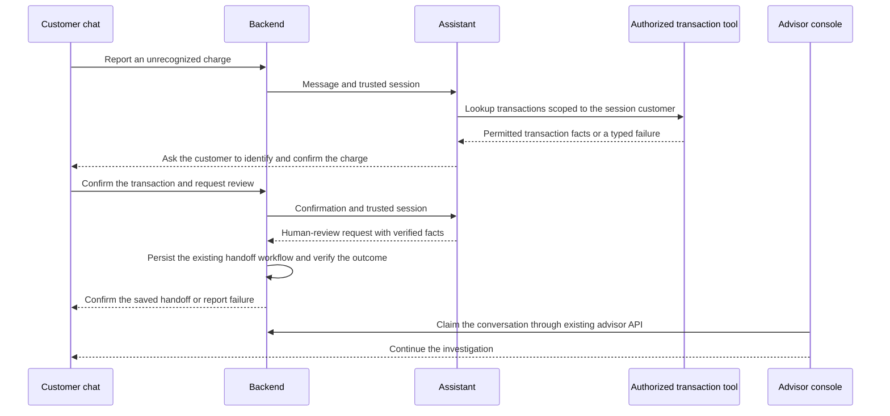

# Dispute integration with an unpromoted fraud model

Status: production integration contract with a **tested local synthetic adapter**, 2026-10-04. The [local demo](../../../agent/LOCAL_DISPUTE_DEMO.md) connects fixture lookup, confirmation, handoff, and advisor reply using an in-memory adapter. The original agent/backend/frontend applications are not yet connected or deployed as this workflow.

## Product behavior

Deliver an assistant for unrecognized-charge intake, transaction lookup, clarification, and human review. The trained fraud candidates remain offline experiments because none met the utility gate. Their measured precision is not changed, simulated upward, or used as an individual transaction probability.

A customer saying that a charge is unrecognized is a report requiring investigation, not a verified fraud label. A human-review request can be justified by that report and workflow policy without a predictive fraud score. The assistant must not infer that the customer or merchant committed fraud.

## Intended flow



This is a target flow. Backend operational handoff writes are separate from the read-only ML experiments. No database schema/table creation, migration, write, or deployment is performed by preparing this contract. Runtime integration must use the existing operational APIs and their authorization/confirmation policy; source transaction tables remain read only.

## Responsibilities

| Component | Responsibility |
|---|---|
| Customer UI | Collect the report and clarification; show verified tool facts and confirmed case/handoff status. Do not show a fraud percentage. |
| Assistant | Classify the request, gather required slots, invoke authorized tools, and prepare a factual review summary. State missing information explicitly. |
| Transaction tool | Enforce customer ownership from a trusted session outside LLM-generated text; return only permitted transaction facts. |
| Policy/backend | Validate conditions and confirmation, authorize the action, save it idempotently, and report success only after persistence is verified. |
| Advisor console | Present the reported charge, verified facts, customer statement, outstanding questions, and saved conversation state. |
| Fraud training | Retain V1–V6 metrics, provenance, and limitations as offline evaluation evidence. No inference call or score-driven routing in this integration version. |

The backend must validate handoff reason codes and conditions outside model prose. LLM-generated values never define policy or authorize an action.

## Existing interfaces and implementation gaps

Read-only inspection found these local interfaces:

- `back/packages/ai-sdk-providers/src/providers-server.ts` accepts `custom_outputs.handoff` with `reason`, `summary`, and `facts`, plus `use_case`, `intent`, `language`, and `blocked`.
- `back/packages/db/src/schema.ts` includes conversation states `ai_agent`, `human_queue`, and `human_agent`.
- `front/src/lib/handoff.ts` handles those states, customer notices, and message polling.
- `agent/configs/routing.yaml` currently sends `COMPLAINT` to `respond` rather than a transaction-dispute tool workflow.
- The inspected non-streaming handler in `agent/src/main.py` returns `custom_outputs` containing `thread_id` only. This contract therefore must not be described as already connected end to end.

These findings concern checked-out source, not a verified live deployment. Some older agent documentation describes different handoff/storage versions. Follow current code and verify the deployed revision before implementation. Preserve the existing backend ownership of conversations.

## Proposed handoff payload

The following example matches the backend's object shape. The new reason value and nested facts are proposals that must be validated against backend policy before use. Example identifiers and amounts are fictional fixtures, not customer records.

```json
{
  "use_case": "UC-02",
  "intent": "COMPLAINT",
  "language": "es",
  "handoff": {
    "reason": "unrecognized_charge_review",
    "summary": "Customer reports the selected charge as unrecognized and requests review. Fraud has not been established.",
    "facts": {
      "transaction_id": "fixture-tx-001",
      "amount": 120.0,
      "currency": "USD",
      "transaction_verified": true,
      "customer_report_confirmed": true,
      "fraud_assessment": {
        "status": "not_validated",
        "risk_score": null,
        "decision_use": false
      },
      "unresolved_questions": ["Was this transaction authorized by the customer?"]
    }
  }
}
```

`transaction_verified` means the lookup found an accessible transaction belonging to the session customer. It does not mean its legitimacy or fraud outcome was verified. Confirmation must be tied to that transaction; a free-form claim or an LLM assertion is insufficient.

The `fraud_assessment` object is status metadata, not an existing model-serving response. No model binary was logged in V5/V6 and there is no validated scoring endpoint to call. Its fields convey that a score is unavailable for decision use. Never replace null with zero, a generated high score, or an offline precision metric.

## UI and communication examples

Customer copy after a verified handoff: “Your request has been sent for review. An advisor will continue the investigation.” Localize to Spanish and Portuguese in the product. Until persistence is confirmed, do not state that a case or handoff was created. Do not promise a refund, block a product, or claim that fraud was confirmed.

Advisor copy: “Unrecognized-charge report — review pending.” Show transaction facts and the customer's statement separately. If model status is relevant to the advisor, show “Predictive fraud assessment unavailable for decision use.” Keep training metrics in the evaluation report rather than the customer flow.

No operational priority formula or monetary threshold is invented here. Approved workflow policy must define those independently of the weak model; preserve transaction currency when evaluating any amount rule.

## Learned component and acceptance evidence

Evaluate the assistant's intent classification and clarification against a documented keyword/rule baseline on the same held-out Spanish/Portuguese cases. Use independently reviewed expected intents, slot values, tool permissions, and handoff outcomes. Team-written examples must be labeled synthetic and held out by scenario/template families; do not claim supplied templated contact text is a real unrecognized-charge conversation dataset.

Measure classification quality with denominators and per-class results, correct transaction selection, confirmation behavior, handoff-summary completeness, unsafe outcomes, latency, and measured cost. Report repeated-run variability where relevant. “Complaint recorded” or “handoff completed” is an intake outcome, not a resolved financial dispute.

Acceptance scenarios include an authenticated single match, multiple possible charges, no match, customer changing the selection, a request for another customer's transaction, missing/expired session, tool failure, persistence failure, duplicate retries, prompt injection, and multilingual ambiguity. A positive outcome requires the correct permitted action and verified result, not only a fluent answer.

Implementation sequence: confirm the deployed checkout and target; connect the complaint workflow to existing permitted tools; validate the handoff contract/policy; connect emitted outputs to backend state; verify the existing customer/advisor UI; evaluate held-out cases; document observed results. Source-table writes and new ML-serving resources are not prerequisites for this version.

## Future model replacement

A fraud model can become an additional input only after demonstrating useful operating precision/recall, verifying label and feature timing, persisting an executable artifact, and passing a frozen final evaluation. Its rollout must define feature freshness, latency, score failure behavior, and monitoring. It never silently changes the meaning of current intake outcomes.

References: [V6 result](../../reports/2026-10-04/training_v6_advanced_report.md), [V5 result](../../reports/2026-10-04/training_v5_catboost_report.md), [fraud-model requirements](requirements.md).

## Local implementation evidence

The offline adapter is implemented in `agent/src/local_dispute_demo.py`, with reusable intake policy in `agent/src/dispute_intake.py`. It uses the existing `policy_escalation` handoff reason and nested `facts.verified_data`, with predictive assessment explicitly unavailable for decision use. A separate customer/advisor harness is available at localhost port 8010. The [validation report](../../../agent/reports/2026-10-04/local_dispute_demo_report.md) records 133 selected-suite passes and successful Chrome workflows. This does not validate learned-component quality or change the production implementation gaps above.
