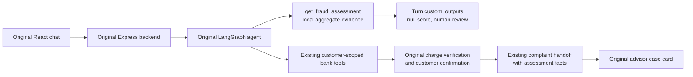

# Fraud assessment in the original assistant

Status: integrated into the existing AWS agent and web/backend on 2026-10-05, using image tag `0ebfff68` after merging `origin/main` commit `20e0e98`. See [the AWS integration report](../../reports/2026-10-05/aws_integration_report.md). The separate dispute demo was removed. The earlier local launch had personal-identity access failures and intentionally disabled chat persistence; those restrictions do not describe the production identity.

## What is integrated

The original React frontend, Express backend and LangGraph agent remain the application. `get_fraud_assessment` is a native tool inside the existing agent, not a second chatbot or a model-serving endpoint.

The complaint route runs the availability tool in code before collecting the complaint. It also exposes the tool to the LLM. Its result accompanies the turn as `custom_outputs.fraud_assessment`, including when bank reads fail. After the original collector verifies the charge and obtains confirmation, code attaches the same policy to `custom_outputs.handoff.facts.fraud_assessment`. The existing backend preserves those facts, and the original advisor case card shows a Spanish/Portuguese review notice. No new handoff reason or database field is introduced.



The local launch has chat persistence disabled. The diagram's handoff/console steps describe the existing application path when data access and authorized persistence are available; they were verified with fixtures, not performed against a live database during this task.

## Model availability contract

The tool accepts no customer ID, transaction ID or score. Locally it reads the V5/V6 aggregate reports from `ml/reports/2026-10-04`; the AWS image uses compact copies in `agent/configs/fraud-evidence` when the repository reports directory is absent. `FRAUD_REPORT_DIR` takes precedence without falling back to another directory when its evidence is missing or malformed. Invalid or absent evidence returns `unavailable`.

```json
{
  "schema_version": "1.0",
  "scope": "model_availability",
  "score_status": "not_validated",
  "risk_score": null,
  "fraud_prediction": null,
  "automatic_decisions_enabled": false,
  "review_required": true,
  "reason_codes": ["NO_VALIDATED_INFERENCE_ARTIFACT", "HUMAN_REVIEW_REQUIRED"]
}
```

The actual result also includes a small `experiments` list with candidate/run IDs and measured aggregate validation precision, recall and alert counts. These are offline measurements, never an individual transaction probability. They are not displayed to customers as a fraud percentage. A report claiming promotion cannot enable inference in this implementation.

Neither V5 nor V6 logged an executable model binary. No validated inference endpoint, online feature service or transaction scoring implementation exists. All V1–V6 training code, notebooks and results are preserved. No new training run was launched for this integration.

## Verification and policy

Customer identity continues to come from the trusted session; `bind_customer` discards any LLM-supplied customer ID. The original collector and `verify_case` enforce product ownership and match the charge against bank rows. The model availability tool does not accept a transaction and does not establish that a charge is fraudulent.

Human review follows the customer's complaint and the existing verified/confirmed workflow, independently of model metrics. An unavailable bank read produces the original tool-failure response and no handoff. The assistant must not assert a saved case, confirmed fraud, refund or account block when it has no verified result.

## Local data access

`main` now uses Lakebase for bank reads. The personal CLI user's Lakebase connection was rejected. An explicit `BANK_READ_SOURCE=databricks` option lets the same bank tools and backend product queries read the existing Gold tables through the SQL Statements API. Lakebase remains the default; there is no automatic fallback or permission grant.

The agent adapter accepts only its three existing customer-scoped SELECT templates. Backend statements come only from the existing application queries and use allowlisted bank tables. Values stay parameterized; responses are bounded and incomplete/failed results are rejected. Warehouse statements cancel after the configured wait. No table, schema, UC function or database is created or modified.

Live read checks found:

- `workspace.bank_gold`: missing `USE SCHEMA` (SQLSTATE `42501`). SELECT on the required Gold tables cannot be established while schema access is blocked.
- `workspace.bank_silver.products`, `complaints`, `customers`: missing `SELECT` (SQLSTATE `42501`).
- Lakebase: password authentication rejected for the personal CLI identity.

Reading `workspace.bank_silver.transactions` for ML does not confer access to these other resources. These checks concern the personal local identity; they were not repeated as the newly authenticated `pqbas` identity. The existing production Databricks service principals retain their prior access. No grants were executed.

## Validation

See [the local integration guide](../../../LOCAL_MAIN_INTEGRATION.md) for exact launch commands and [the validation report](../../reports/2026-10-04/main_integration_report.md) for observed results.

Validation includes model availability without fabricated scores, missing/corrupt evidence, a forged promotion claim, customer-ID override rejection, SELECT-template restrictions, incomplete results, the original complaint handoff, backend fact preservation, and the original UI's review notice. The real browser greeting traversed frontend → backend → agent. A real complaint returned the explicit experimental model status and the safe bank-read failure.

## Future predictive inference

Prediction requires a saved executable model, reproducible features available at decision time, a useful frozen operating point, verified label provenance, and independent evaluation. It must define latency, freshness, failure behavior and monitoring before rollout. Those requirements are separate from connecting the experimental status to the existing complaint workflow.

References: [V6 result](../../reports/2026-10-04/training_v6_advanced_report.md), [V5 result](../../reports/2026-10-04/training_v5_catboost_report.md), [fraud-model requirements](requirements.md).
