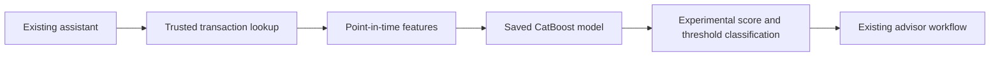

# Executable transaction predictions

The assistant must compute a real model output for an authorized transaction,
instead of returning only aggregate training evidence. Source tables, permissions,
database schemas and the sealed final-test labels remain unchanged.

V7 uses CatBoost with the frozen V5 C3 hyperparameters and a feature contract
supported by both existing Gold and Lakebase transactions. Geographic features
are excluded because the existing serving table has no coordinates. Fit-only
median imputation, categorical normalization and predictor order travel with the
native model binary. Save/load and training/serving parity must pass before use.

The operating threshold is frozen on April–June 2025 at approximately a 1% review
budget. July–December 2025 provides descriptive evaluation. This experimental
model is not promoted for automatic financial decisions; its measured precision
must be reported without substituting another experiment's metrics.

Inference binds customer identity outside LLM-generated arguments, verifies an
active owned product, and reads the transaction and strictly earlier customer
history. Labels, existing fraud scores, status and processing date are excluded
from model input. Missing data, invalid artifacts and failures return an explicit
unavailable result; no invented prediction or substituted constant is permitted.

`risk_score` is a finite model output in [0, 1], not a validated customer fraud
probability. `fraud_prediction` is the model's binary threshold classification,
not confirmation of fraud or innocence. `review_required` remains true and
`automatic_decisions_enabled` remains false. The advisor view must label the
score experimental and distinguish it from measured precision.

Acceptance requires an executable artifact, native save/load parity, feature
parity, cross-customer rejection, same-timestamp exclusion, currency-specific
history, source-field exclusion, bounded queries, and real deployed inference.
No automatic refund, account block or database modification is introduced.
